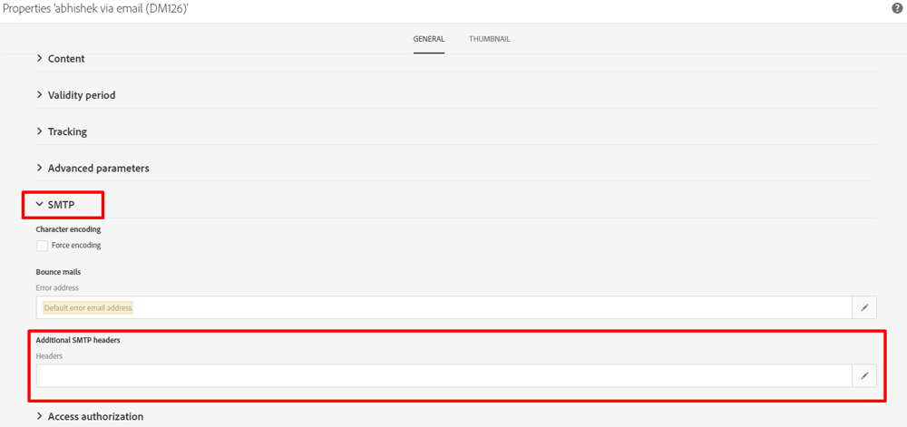

# Qu’est-ce que l’en-tête List-Unsubscribe ? Et comment cela peut-il être implémenté dans ACS ?

Cet article fournit des informations sur l’en-tête List-Unsubscribe et sur la manière dont il peut être implémenté dans ACS.

## Description {#description}

### <b>Environnement</b>

- Campaign
- Campaign Standard

### <b>Problème/Symptôme</b>

<b>Qu’est-ce que l’en-tête List-Unsubscribe ? Et comment cela peut-il être implémenté dans ACS ?</b>

L’en-tête List-Unsubscribe est un en-tête d’email facultatif que vous pouvez ajouter à vos messages. Il permet aux abonnés d’afficher un bouton de désabonnement sur lequel ils peuvent cliquer s’ils souhaitent arrêter automatiquement de recevoir votre email.

List-Unsubscribe est utilisé par Gmail, Outlook.com, et d’autres. Il vise à réduire les plaintes en donnant aux abonnés une méthode différente pour se désabonner en toute sécurité sans affecter négativement votre réputation d’envoi.

L’en-tête List-Unsubscribe est facilement confondu avec deux autres options que les abonnés peuvent utiliser pour se désabonner de votre email.

L&#39;option List-Unsubscribe n&#39;est pas :

- Bouton spam : lorsque vous cliquez sur un bouton de courrier indésirable, une plainte est déclenchée, ce qui a un impact négatif sur votre réputation d’envoi.
- Lien de désabonnement dans l’élément créatif de l’email : ce lien se trouve généralement dans le pied de page de votre élément créatif de HTML et est contrôlé par vous. Cependant, la fonctionnalité List-Unsubscribe est contrôlée par le fournisseur de boîtes aux lettres, si vous l’avez incluse dans vos en-têtes.

En d’autres termes, pensez à l’option List-Unsubscribe comme troisième méthode pour que les abonnés soient supprimés de votre liste de messagerie. Et c&#39;est une option qui aide à protéger votre réputation en réduisant potentiellement vos plaintes.

L’en-tête d’email List-Unsubscribe est défini dans la norme RFC 2369.

<b>Qu’est-ce que l’en-tête List-Unsubscribe ? </b>

`span style=Find No Results`

## Résolution {#resolution}

<b>Mise en oeuvre dans ACS :</b>

Dans ACS, il est uniquement possible d&#39;ajouter un en-tête SMTP dans le modèle de diffusion (il ne peut pas être ajouté directement dans la diffusion).

Voici les étapes à suivre :

1. Ouvrez et modifiez les propriétés de votre modèle de diffusion.
2. Cliquez sur la section SMTP et modifiez les en-têtes des en-têtes SMTP supplémentaires.     
3. Ajoutez la ligne de commande suivante :    `List-Unsubscribe: <mailto:bounce@subdomain?subject=unsubscribe<%=escape(context.mimeMessageId) %>>`

Adresse électronique<b>*bounce@subdomain</b>*représente la variable <b>return npath address</b>
