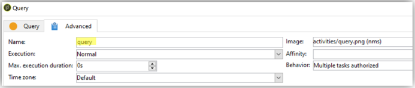

# Bonnes pratiques relatives aux workflows - configuration et surveillance dans Campaign Classic

Cet article explique certaines bonnes pratiques en matière de configuration et de surveillance des workflows dans Adobe Campaign Classic.

## Description {#description}

### <b>Environnement</b>

- Adobe Campaign
- Adobe Campaign Classic

### <b>Problème</b>

La plupart du temps, les workflows font partie des principales fonctionnalités (intégrées ou personnalisées) de la plateforme. Pour cette raison, il est très important de prendre soin de leur configuration.

## Résolution {#resolution}

### Configuration générale

#### Organisation

Créez vos workflows, tels qu’un import dans tableXXX, dans un dossier personnalisé.

Si le workflow générique affecte l&#39;ensemble de la plateforme (nettoyage, par exemple), envisagez-vous de l&#39;ajouter dans la <b>Workflows techniques</b> dossier.

#### Nom du workflow

Comme nous l’avons expliqué plus haut, il est très important de donner aux workflows des libellés et des noms appropriés. Comme un opérateur ne se réfère pas toujours à la documentation, renseignez le <b>description</b> pour résumer le processus à exécuter.

Si le workflow fait partie d&#39;un processus impliquant plusieurs workflows, n&#39;hésitez pas à être explicite lorsque vous saisissez un libellé. L&#39;utilisation de nombres est un excellent moyen d&#39;organiser les workflows (par libellé). Par exemple :

- 001 - Import - Import des destinataires
- 002 - Import - Import des ventes
- 003 - Import - Import des détails sur les ventes
- 010 - Export - Export des logs de diffusion
- 011 - Export - Export des logs de tracking

#### Gravité

Configurez la gravité d’un workflow dans les propriétés du workflow, dans la variable <b>Exécution</b> tab :

- Normale
- Production
- Critique

Fournir ces informations lors de la création d’un workflow permet de comprendre la gravité du processus configuré.

#### Journaux

Méthode JavaScript `logInfo()` est une excellente solution pour déboguer un workflow. Elle est utile, mais elle doit être utilisée avec précaution, en particulier pour les activités qui sont fréquemment exécutées : elle peut surcharger les logs et augmenter considérablement la taille de la table des logs.

Mais il se peut également que vous ayez besoin de plus de `logInfo()`. Deux autres solutions sont disponibles.

<b>Conserver le résultat des populations intermédiaires entre deux exécutions</b>

Cette option, disponible dans les propriétés du workflow <b>Général</b> peut être aussi utile que dangereux. Elle empêche Adobe Campaign de supprimer les tables temporaires créées entre deux exécutions. Bien qu’il puisse s’avérer utile pour les environnements de développement, il est interdit de l’utiliser sur les environnements de production et doit être surveillé. Le fait de conserver des tables temporaires peut entraîner une augmentation significative de la taille de la base de données et, par la suite, une limite de taille. De plus, cela ralentira la sauvegarde.

<b>Aucun workflow</b> cette option doit être cochée en production à tout moment.

<b><u>Enregistrer les requêtes SQL dans le journal</u>:</b>

Disponible dans le <b>Exécution</b> dans les propriétés du workflow, toutes les requêtes SQL générées par l&#39;outil seront enregistrées dans les différentes activités. C&#39;est une excellente façon de voir ce qui est réellement exécuté par la plateforme. Toutefois, cette option ne doit être utilisée que temporairement pendant le développement et non activée en production.

#### Surveillance

Tous les workflows planifiés s&#39;exécutant dans des environnements de production doivent être surveillés afin d&#39;être avertis en cas d&#39;erreur.

Dans les propriétés du workflow, sélectionnez une <b>groupe de superviseurs</b>, soit le groupe par défaut &quot;Superviseurs de workflow&quot;, soit un groupe personnalisé. Assurez-vous qu&#39;au moins un opérateur appartient à ce groupe, avec une configuration d&#39;email.

<b><u>Ne pas suspendre les workflows</u>:</b>

Si vous créez un workflow temporaire, assurez-vous qu’il sera en mesure de se terminer correctement et qu’il ne restera pas dans un état &quot;en pause&quot;. S’il est en pause, cela signifie que vous devez conserver les tables temporaires et ainsi augmenter la taille de la base de données.

### Dans le workflow

#### Nom de l’activité

Lors du développement de votre workflow, toutes les activités auront un nom, tout comme tous les objets Adobe Campaign. Bien que le nom soit généré par l’outil, nous vous recommandons de le renommer avec un nom explicite lors de sa configuration. Si vous le faites plus tard, il se peut que cela interrompe le workflow avec des activités utilisant le nom d’une autre activité précédente. Il serait donc difficile de mettre à jour les noms par la suite.

Le nom de l’activité se trouve dans la variable <b>Avancé</b> . Ne les laissez pas nommés query, query1, query11, mais donnez-leur des noms explicites tels que `querySubscribedRecipients`. Ce nom apparaît dans le journal et, le cas échéant, dans les journaux SQL. Il permet de déboguer le workflow lors de sa configuration.

#### JavaScript dans une activité

Vous pouvez ajouter du code JavaScript lors de l&#39;initialisation d&#39;une activité de workflow. Cela peut être effectué dans le <b>Avancé</b> . Pour repérer plus facilement le workflow, il est recommandé d&#39;utiliser deux tirets au début et à la fin du libellé de l&#39;activité, comme suit : *— Mon libellé —*

#### Signal

La plupart du temps, vous ne saurez pas d’où provient le signal. Pour éviter ce problème, utilisez la méthode <b>Commentaire</b> dans le champ <b>Avancé</b> de l’activité Signal afin de documenter l’origine attendue d’un signal pour cette activité.

#### Mise à jour des workflows

Un workflow de production ne doit pas être mis à jour directement. A moins que le processus ne consiste à créer une campagne avec des workflows de modèle, les processus doivent d’abord être testés dans un environnement de développement si possible. Ce n’est qu’après cette validation que le workflow peut être déployé et démarré en production.

Les workflows archivés peuvent être conservés sur des plateformes de développement ou de test, dans une <b>Archivé</b> , mais la production doit rester aussi propre que possible. Les anciens workflows doivent être supprimés de la production s’ils sont inactifs.
