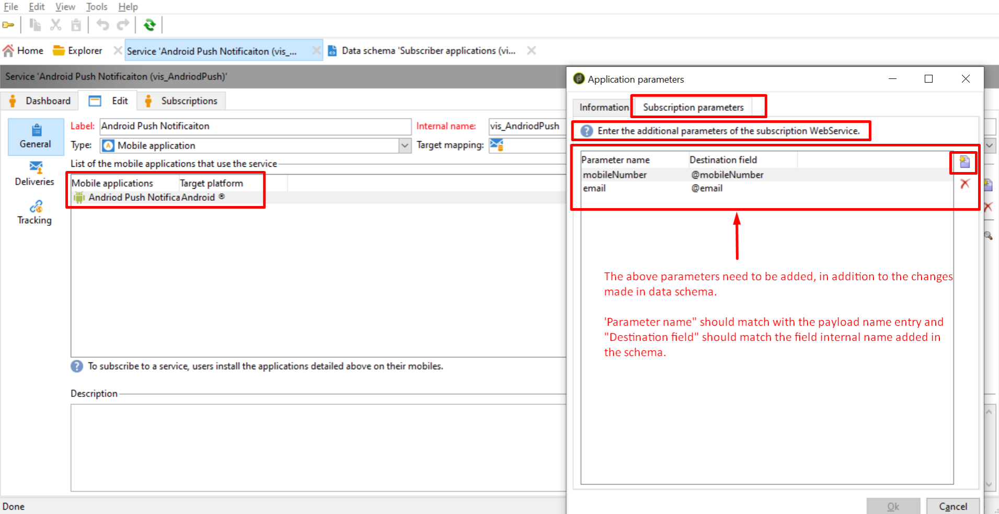

# Les paramètres supplémentaires ne sont pas renseignés dans l’ACC Rcp d’abonnement à l’application

## Description

Nous avons une table Rcp d&#39;abonnement aux applications étendue. Lorsque nous tentons d’insérer des valeurs à l’aide de paires clé-valeur à l’aide de paramètres supplémentaires dans les méthodes d’enregistrement d’appareil, seuls le jeton d’appareil et la clé d’utilisateur sont mis à jour. Vérifiez ceci et indiquez-nous pourquoi les données ne sont pas renseignées.

## Résolution

Comme nous l’avons vu, lors de l’ajout des paramètres supplémentaires dans l’application mobile &quot;Services et abonnements&quot;, nous avons pu renseigner les détails de l’email et du numéro de téléphone.

