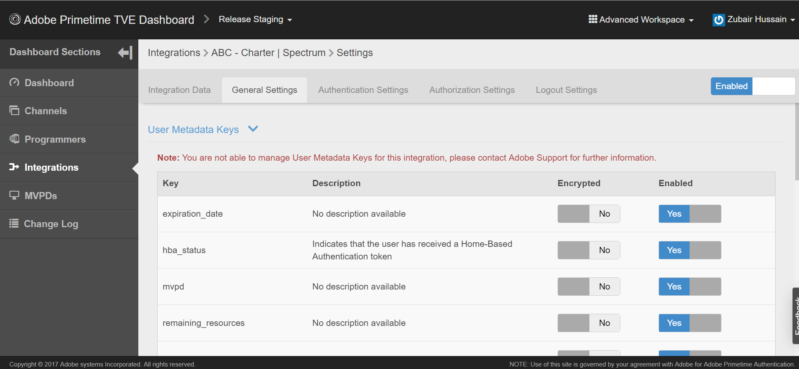

# Comment puis-je confirmer si l’authentification unique (SSO) est activée ou désactivée ?

Découvrez comment désactiver l’authentification unique pour toutes les intégrations.

## Description {#description}

### <b>Environnement</b>

Adobe Pass

### <b>Problème/Symptômes</b>

Test prédéfini, Production prédéfinie, Évaluation des versions et Production des versions

Comment puis-je confirmer si l’authentification unique (SSO) est activée ou désactivée pour mon canal ?

## Résolution {#resolution}

L’authentification unique (SSO) est activée par défaut pour toutes les intégrations. Cependant, elle peut être configurée de sorte que l’authentification unique soit désactivée.

Pour confirmer si l’authentification unique est désactivée, vous pouvez passer en revue l’intégration dans le tableau de bord TVE.

Les attributs suivants sont définis sur OUI, si l’authentification unique a été désactivée pour une intégration Canal - Distributeur de programmation vidéo multicanal (MVPD) :

1. <b>Auth / Agrégateur —`>`     OUI</b>
2. <b>Activer AuthN passif —`>`     OUI</b>

Si les paramètres ne sont pas définis ou définis sur NO, SSO est disponible pour l’intégration. Si vous définissez ces paramètres sur NON, vous pouvez également activer la fonction SSO.

Vous pouvez trouver ces paramètres en vous rendant dans votre intégration spécifique (assurez-vous que l’espace de travail avancé est sélectionné).

1. Cliquez sur votre intégration spécifique dans le tableau de bord TVE.
2. Sélectionnez l’onglet Paramètres généraux et faites défiler l’écran vers le bas.
3. Cliquez sur le bouton *Afficher la propriété supplémentaire* pour afficher la valeur Auth/Agrégateur et Activer AuthN passif. 

