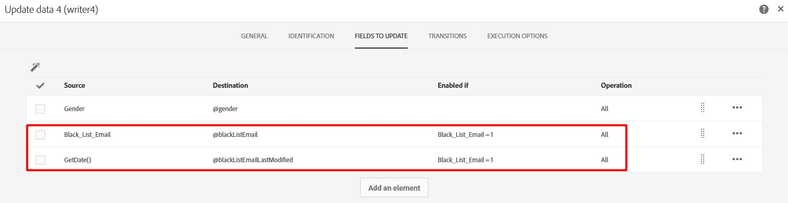

# blackListEmailLastModified est modifié même lorsque blacklistEmail n&#39;est pas modifié

## Description


| Cas d’utilisation : lors de l’importation de profils à partir d’un fichier, l’une des propriétés clés lues à partir du fichier est `blacklistEmail`. Comme illustré ci-dessous, si vous utilisez une mise à jour conditionnelle du champ source pour éviter des mises à jour inutiles du champ de destination.<br><br><br><br>Cependant, vous pouvez remarquer que la variable `blackListEmailLastModified` est modifié pour tous les profils existants importés. Le comportement attendu est que la variable `blackListEmailLastModified` ne doit être modifié que lorsque  `blacklistEmail` est modifié.<br><br>Voici la mise à jour SQL générée :<br><br>UPDATE NmsRecipient <br>     SET iGender=COALESCE( OutTbl.iFld1084817585, 0),<br>         iBlackListEmail=COALESCE( CASE OutTbl.iEnaFld1086062770 LORSQUE 1 PUIS OutTbl.iFld1086062770 AUTRE FIN NULL, CASE QUAND OutTbl.iEnaFld1086062770=1 PUIS 0 AUTRE FIN iBlacklisteEmail),<br>         iModifiedById=16107610,tsLastModified=$(curdate),<br>         tsBlackListEmailLastModified=$(curdate),<br>         tsBlackListAllLastModified=$(curdate) <br>    À partir de wkf11373941_23_1 OutTbl <br>   WHERE NmsRecipient.iRecipientId=OutTbl.iPKey_1 <br>     AND OutTbl.iRecProcState$(l) <br>     AND OutTbl.iRecProcState=$(l) <br>     AND OutTbl.iPKey_10<br><br>Comme le montre la mise à jour ci-dessus, la variable `blackListEmailLastModified` (`tsBlackListEmailLastModified`) est mis à jour, peu importe si `blacklistEmail` (`iBlackListEmail`) est mis à jour ou non. |
| --- |


## Résolution


La solution consiste à ajouter la variable `blackListEmailLastModified`  à la mise à jour conditionnelle.

Voir ci-dessous :



Et la mise à jour SQL générée montre que la variable `blackListEmailLastModified` n’est modifié que lorsque `blacklistEmail` est modifié.

```
UPDATE NmsRecipient 
    SET iGender=COALESCE( OutTbl.iFld1084817585, 0),
        iBlackListEmail=COALESCE( CASE OutTbl.iEnaFld1086062770 WHEN 1 THEN OutTbl.iFld1086062770 ELSE NULL END, CASE WHEN OutTbl.iEnaFld1086062770=1 THEN 0 ELSE iBlackListEmail END),
        tsBlackListEmailLastModified=COALESCE( CASE OutTbl.iEnaFld1169490137 WHEN 1 THEN OutTbl.tsFld1169490137 ELSE NULL END, CASE WHEN OutTbl.iEnaFld1169490137=1 THEN NULL ELSE tsBlackListEmailLastModified END),
        iModifiedById=16107610,
        tsLastModified=$(curdate),
        tsBlackListAllLastModified=$(curdate) 
   FROM wkf11373941_25_1 OutTbl 
  WHERE NmsRecipient.iRecipientId=OutTbl.iPKey_1 
    AND OutTbl.iRecProcState$(l) 
    AND OutTbl.iRecProcState=$(l) 
    AND OutTbl.iPKey_10
```
