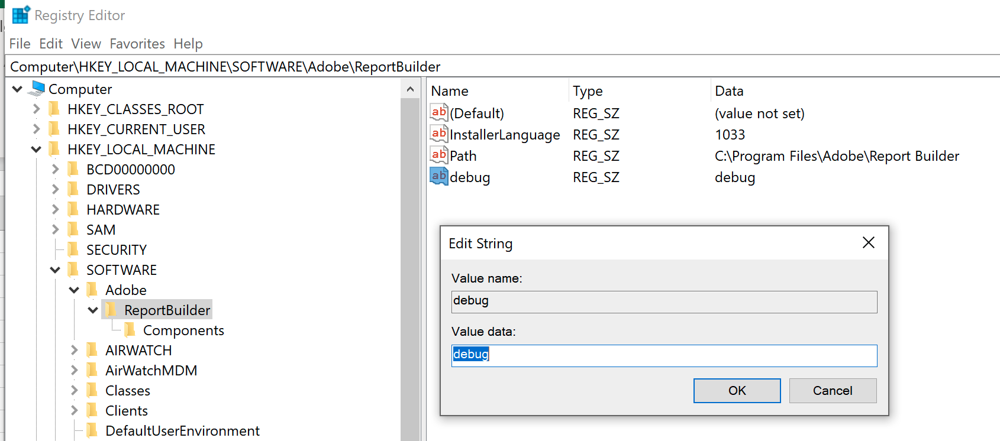

# Analytics - Journalisation détaillée des Reports Builder

Si vous rencontrez des problèmes lors de la connexion à Adobe Analytics Report Builder (ARB), vous pouvez résoudre le problème en suivant les étapes fournies dans cet article.

## Description {#description}

### <b>Environnement</b>

- Customer Journey Analytics
- Analytics

### <b>Problèmes/symptômes</b>

Comment activer la connexion dans ARB lorsque vous vous connectez pour vérifier que la case de journalisation ne fonctionne pas ?

## Résolution {#resolution}

Ouvrez le registre sous Windows : [https://support.microsoft.com/en-us/windows/how-to-open-registry-editor-in-windows-10-deab38e6-91d6-e0aa-4b7c-8878d9e07b11](https://support.microsoft.com/en-us/windows/how-to-open-registry-editor-in-windows-10-deab38e6-91d6-e0aa-4b7c-8878d9e07b11)

Recherchez le dossier dans l’un des dossiers suivants. Le chemin d’accès et le nom du fichier peuvent être légèrement différents selon la version en bits ARB, etc.

Computer\HKEY_LOCAL_MACHINE\SOFTWARE\WOW6432Node\Adobe\ReportBuilder

OR

Computer\HKEY_LOCAL_MACHINE\SOFTWARE\Adobe\ReportBuilder

Clic droit

Ajouter une nouvelle chaîne

Fournir un nom de valeur

Saisir les données de valeur de &quot;debug&quot;

