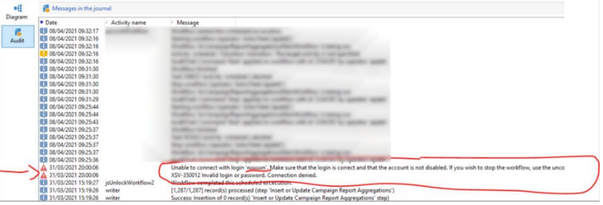

# ACC || utilisateur empêchant l’exécution du flux de travaux

## Description

Un de mes clients a les workflows qui génèrent le rapport qui se sont arrêtés parce qu&#39;ils ont désactivé un utilisateur qui a quitté l&#39;entreprise. Lors de la désactivation de l’utilisateur de Campaign Classic dans la gestion des accès, le flux de travaux renvoie toujours une erreur. Ils ont essayé de réactiver l’utilisateur et ils ont exécuté le workflow. Mais pourquoi s’est-il arrêté lorsque j’ai désactivé l’utilisateur ? Et comment puis-je continuer à travailler une fois que je l&#39;ai désactivé ?

## Résolution

Question avec capture d’écran —

Un de mes clients a les workflows qui génèrent le rapport qui se sont arrêtés parce qu&#39;ils ont désactivé un utilisateur qui a quitté l&#39;entreprise. Lors de la désactivation de l’utilisateur de Campaign Classic dans la gestion des accès, le flux de travaux renvoie toujours une erreur. Ils ont essayé de réactiver l’utilisateur et ils ont exécuté le workflow. Mais pourquoi s’est-il arrêté lorsque j’ai désactivé l’utilisateur ? Et comment puis-je continuer à travailler une fois que je l&#39;ai désactivé ?

Quelqu’un peut-il suggérer s’il existe un autre moyen de supprimer l’utilisateur afin que le client puisse utiliser le flux de travaux.

Solution --

Lorsque vous rencontrez cette erreur,

1. Ouvrez le workflow.
2. Cliquez sur Modifier la source XML ...
3. Rechercher un mot-clé <b>login=&quot;</b>
4. Vous trouverez un élément dans le XML comme illustré ici
5. Dans votre cas, la connexion aura une valeur<b>.</b>
6. L’attribut de connexion vide à créer est <b>login=&quot;&quot;</b>
7. Cliquez sur Ok pour fermer la fenêtre contextuelle.
8. Enregistrez le workflow.
9. Redémarrez le workflow. Si le workflow fait partie d’une campagne (ce qui sera le cas dans 99 % des cas), demandez à l’utilisateur concerné côté client de redémarrer ce workflow à l’aide de son identifiant, depuis le dossier Campaign et non depuis le dossier Workflow.
10. Il devrait être corrigé maintenant.
11. Plus tard, accédez au dossier Vue des workflows et recherchez <b>*mdata contient login=&quot;username&quot;</b>* pour rechercher d’autres workflows susceptibles d’être affectés.
12. Répétez les étapes ci-dessus pour chacune d’elles.

J&#39;espère que ça aide.
