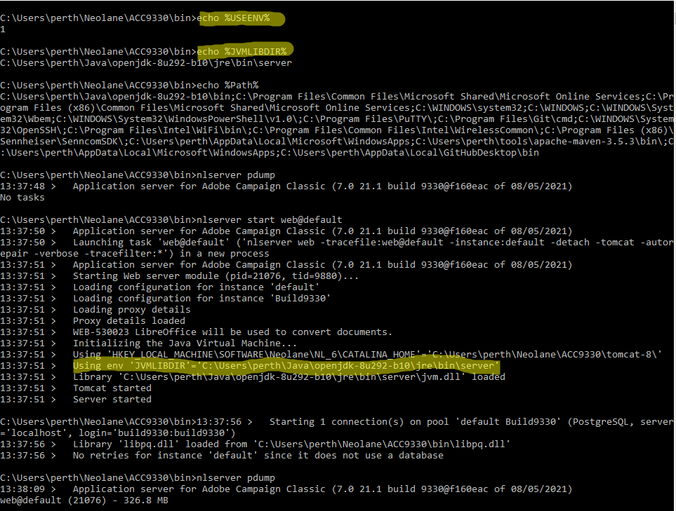

# Erreur ACC v7 : &quot;JVM-510037 Impossible de trouver la bibliothèque dynamique Java.&quot;


Il existe 2 solutions : vous pouvez ajouter manuellement la clé JavaSoft au registre Windows sous `Computer\HKEY_LOCAL_MACHINE\SOFTWARE`ou vous pouvez utiliser deux variables d’environnement Windows pour indiquer où la variable `jvm.dll` est accessible par le module Web.

## Description {#description}


### <b>Environnement</b>

Adobe Campaign Classic v7 (ACC v7)


### <b>Problèmes/symptômes</b>

<b>Cas pratique</b> - Ce problème se produisait lors du remplacement du JDK d’Oracle par Open JDK sur les instances Campaign s’exécutant sous Windows.

Dans cet exemple, le JDK Oracle v1.8.0.191 était installé sur toutes les instances Windows Campaign. Après avoir remplacé le JDK Oracle par Open JDK dans l’une de leurs instances Campaign, le WEB n’a pas pu démarrer et a donné l’erreur suivante :

<b>`JVM-510037 Cannot find the Java dynamic library. Check that a JDK or a JRE is installed on the machine. (iRc=-53)`</b>

Toutefois, Java est correctement installé avec les variables d’environnement Path et JAVA_HOME appropriées.


## Résolution {#resolution}


Pour exécuter le module Web, la bibliothèque dynamique JVM doit être visible dans Campaign. En supprimant le JDK Oracle, la clé JavaSoft du registre Windows est supprimée et toutes les références à cette bibliothèque JVM sont également perdues.

Il existe deux solutions pour résoudre ce problème :

### <u>#1 de solution</u>

Vous pouvez ajouter manuellement la clé JavaSoft au registre Windows sous `Computer\HKEY_LOCAL_MACHINE\SOFTWARE`.


Voici un exemple (avec `OpenJDK 1.8_292`) de ce que vous devez ajouter :

`Windows Registry Editor Version 5.00`

`[ HKEY_LOCAL_MACHINE\SOFTWARE\JavaSoft]`


```
[ HKEY_LOCAL_MACHINE\SOFTWARE\JavaSoft\Java Runtime Environment] "CurrentVersion"="1.8""BrowserJavaVersion"="11.301.2"
```


```
[ HKEY_LOCAL_MACHINE\SOFTWARE\JavaSoft\Java Runtime Environment\1.8] "MicroVersion"="0""RuntimeLib"="C:\\Users\\perth\\Java\\openjdk-8u292-b10\\jre\\bin\\server\\jvm.dll""JavaHome"="C:\\Users\\perth\\Java\\openjdk-8u292-b10\\jre"
```


```
[ HKEY_LOCAL_MACHINE\SOFTWARE\JavaSoft\Java Runtime Environment\1.8.0_292] "MicroVersion"="0""RuntimeLib"="C:\\Users\\perth\\Java\\openjdk-8u292-b10\\jre\\bin\\server\\jvm.dll""JavaHome"="C:\\Users\\perth\\Java\\openjdk-8u292-b10\\jre"
```


 
Le dossier de chemin d’accès suivant a été ajouté à la variable <b>`Path` </b>Variable d’environnement.

`C:\Users\perth\Java\openjdk-8u292-b10\bin`

Le module Web doit pouvoir démarrer comme prévu :


### <u>#2 de solution</u>

L’utilisation de deux variables d’environnement Windows peut être définie pour indiquer où la variable `jvm.dll` est accessible par le module Web.

Les variables sont les suivantes :

- `USEENV=1`
- `JVMLIBDIR=<the path of the jvm.dll file>`


Voici un exemple :



Notez que l’utilisation de la variable `JVMLIBDIR` est visible à partir du journal si la journalisation en mode verbeux est activée sur le module Web.
