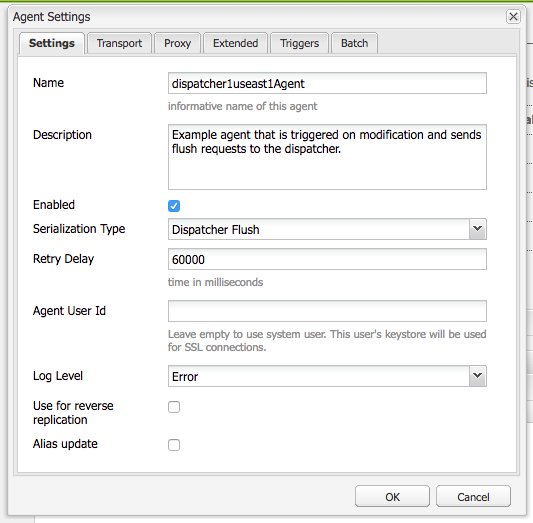

# Purge du Dispatcher Adobe Managed Services

Découvrez les nuances des mécanismes de purge du cache et des workflows d’activation du contenu, essentiels pour préserver l’efficacité du système et l’intégrité des données.

## Description {#description}

### <b>Environnement</b>

Experience Manager

### <b>Problème/Symptômes</b>

Ce document fournit des conseils sur la manière dont la purge se produit et explique le mécanisme qui exécute la purge du cache et l’invalidation.
 Fonctionnement 
<b>Ordre des opérations</b>

Le workflow type est mieux décrit lorsque les auteurs de contenu activent une page. Lorsque l’éditeur reçoit le nouveau contenu, il déclenche une demande de purge vers Dispatcher, comme illustré dans le diagramme suivant :

Cet enchaînement d’événements souligne que nous ne vidons les éléments que lorsqu’ils sont nouveaux ou ont changé.  Cela permet de s’assurer que le contenu a été reçu par l’éditeur avant d’effacer le cache afin d’éviter les conditions de concurrence dans lesquelles le vidage peut se produire avant que les modifications ne soient récupérées auprès de l’éditeur.

### <b>Agents de réplication</b>

Sur l’instance de création, un agent de réplication est configuré pour indiquer à l’éditeur que lorsqu’un élément est activé, il déclenche l’envoi du fichier et de toutes ses dépendances à l’éditeur.

Lorsque l’éditeur reçoit le fichier, un agent de réplication est configuré pour pointer vers Dispatcher qui se déclenche sur l’événement à la réception.  Il sérialise ensuite une requête de purge et la publie sur Dispatcher.

#### AGENT DE RÉPLICATION DE L’AUTEUR

Voici quelques exemples de captures d’écran d’un agent de réplication standard configuré :

Il existe généralement 1 ou 2 agents de réplication configurés sur l’auteur pour chaque éditeur vers lequel ils répliquent du contenu.

Le premier est l’agent de réplication standard qui envoie les activations de contenu à .

Le second est l’agent inverse.  Cette option est facultative et configurée pour vérifier dans la boîte d’envoi de chaque éditeur s’il existe un nouveau contenu à extraire dans l’auteur en tant qu’activité de réplication inverse.

#### AGENT DE RÉPLICATION DE L’ÉDITEUR

Voici un exemple de capture d’écran d’un agent de réplication de purge standard configuré :

#### RÉPLICATION DE FLUX DE DISPATCHER REÇANT UN HÔTE VIRTUEL

Le module de Dispatcher recherche des en-têtes particuliers à connaître lorsqu’une demande de POST doit être transmise aux rendus AEM ou s’il s’agit d’une demande sérialisée en tant que demande de purge et qui doit être traitée par le gestionnaire de Dispatcher lui-même.  Voici une capture d’écran de la page de configuration qui affiche ces valeurs :

La page des paramètres par défaut affiche la variable <b>Type de sérialisation</b> as *Purge du Dispatcher* et définit le niveau d’erreur :

Dans l’onglet Transport, vous pouvez voir l’URI défini pour pointer vers l’adresse IP du Dispatcher qui reçoit les requêtes de purge.  Le chemin /dispatcher/invalidate.cache n’est pas la manière dont le module détermine s’il s’agit d’une purge. Il s’agit uniquement d’un point de terminaison évident que vous pouvez voir dans le journal d’accès pour savoir qu’il s’agissait d’une requête de purge.  Dans l’onglet Étendu , passez en revue les éléments qui sont présents pour vérifier qu’il s’agit d’une requête de purge envoyée au module de Dispatcher.

La méthode HTTP pour les requêtes de vidage est simplement une requête GET avec certains en-têtes de requête spéciaux :

- CQ-Action

  Cette opération utilise une variable AEM basée sur la requête et la valeur est généralement *activer ou supprimer* 

- CQ-Handle Utilise une variable d’AEM basée sur la requête et la valeur est généralement le chemin complet vers l’élément vidé, par exemple. */content/dam/logo.jpg*

- CQ-Path

  Cette opération utilise une variable d’AEM basée sur la requête et la valeur est généralement le chemin d’accès complet à l’élément en cours de purge, par exemple. */content/dam*

- Hôte

  C’est là que l’en-tête de l’hôte est mis en file d’attente pour cibler un `<` VirtualHost`>`  qui est configuré sur le serveur web Apache du dispatcher (/etc/httpd/conf.d/enabled_vhosts/aem_flush.vhost).  Il s’agit d’une valeur codée en dur qui correspond à une entrée dans le fichier aem_flush.vhost *ServerName* ou *ServerAlias*

  

  Dans l’onglet Triggers , notez les déclencheurs activés et utilisez-les et indiquez-les.

- <b>Ignorer la valeur par défaut</b>

  Cette option est activée de sorte que l’agent de réplication ne soit pas déclenché lors de l’activation d’une page.  Lorsqu’une instance d’auteur modifie une page, cela déclenche une purge.  Comme il s’agit d’un éditeur, ne déclenchez pas ce type d’événement.

- <b>À réception</b>

  Lorsqu’un nouveau fichier est reçu, déclenchez une purge.  Ainsi, lorsque l’auteur nous envoie un fichier mis à jour, déclenchez et envoyez une demande de purge au dispatcher.

- <b>Aucun contrôle de version</b>

  Cochez cette option pour éviter que l’éditeur ne génère de nouvelles versions, car un nouveau fichier a été reçu.  Il vous suffit de remplacer le fichier que nous avons et de compter sur l’auteur pour effectuer le suivi des versions plutôt que sur l’éditeur.

Maintenant, si vous observez à quoi ressemble une requête de purge standard sous la forme d’une commande curl
   

| `$ curl \``-H``"CQ-Action: Activate"` `\``-H``"CQ-Handle: /content/dam/logo.jpg"` `\``-H``"CQ-Path: /content/dam/"` `\``-H``"Content-Length: 0"` `\``-H``"Content-Type: application/octect-stream"` `\``-H``"Host: flush"` `\``http:``//10``.43.0.32:80``/dispatcher/invalidate``.cache` |
| --- |

Cet exemple de purge purge le chemin d’accès /content/dam en mettant à jour le fichier .stat dans ce répertoire.

### Le fichier .stat

Le mécanisme de purge est simple par nature et nous voulons expliquer l&#39;importance de <b>.stat</b> fichiers générés à la racine du document dans laquelle les fichiers de cache sont créés.

Dans les fichiers .vhost et _farm.any, nous configurons une directive racine du document pour spécifier où se trouve le cache et où stocker/servir les fichiers lorsqu’une demande d’un utilisateur final arrive.

Si vous exécutez la commande suivante sur votre serveur Dispatcher, vous commencerez à rechercher des fichiers .stat.

| 1 | `$``find` `/mnt/var/www/html/` `-``type` `f -name``".stat"` |
| --- | --- |

#### Voici un diagramme de l’apparence de cette structure de fichiers lorsque vous avez des éléments dans le cache et qu’une demande de purge a été envoyée et traitée par le module de Dispatcher :

#### 

NIVEAU DU FICHIER STADE

Notez que dans chaque répertoire, un fichier .stat était présent.  Il s’agit d’un indicateur indiquant qu’une purge a eu lieu.  Dans l’exemple ci-dessus, <b>niveau de fichier stat</b> a été défini sur <b>3</b> dans le fichier de configuration de ferme correspondant.

Le paramètre stat file level indique le nombre de dossiers au sein desquels le module traverse et met à jour un fichier .stat.  Le fichier .stat est vide. Il ne s’agit rien de plus qu’un nom de fichier avec un horodatage et peut même être créé manuellement, mais il exécute la commande tactile sur la ligne de commande du serveur du répartiteur.

Si le paramètre de niveau de fichier stat est défini sur une valeur trop élevée, chaque requête de purge traverse l’arborescence de répertoires pour toucher les fichiers .stat.  Cela peut devenir un accès aux performances majeur sur les grandes arborescences du cache et avoir une incidence sur les performances globales de votre dispatcher.

Si vous définissez ce niveau de fichier sur une valeur trop basse, une requête de purge peut effacer plus que prévu.  Ce qui, à son tour, provoquerait l’exécution du cache plus souvent avec moins de requêtes diffusées à partir du cache et peut entraîner des problèmes de performances.

Remarque :

Définissez le niveau du fichier stat à un niveau raisonnable.  Examinez la structure de vos dossiers et assurez-vous qu’elle est configurée pour permettre des vidages concis sans avoir à parcourir trop de répertoires.   Testez-le et assurez-vous qu’il correspond à vos besoins lors d’un test de performance du système.

Un bon exemple est un site qui prend en charge les langues.  L’arborescence de contenu classique contiendra les répertoires suivants :

/content/brand1/fr/us/

Dans cet exemple, utilisez un paramètre de niveau fichier stat de 4.  Cela vous permet de vider le contenu qui se trouve sous la balise <b>us</b> pour empêcher le vidage des dossiers de langue.

#### GESTION DE L’HORODATAGE DU FICHIER STADE

Lorsqu’une demande de contenu entre dans la même routine se produit

1. L’horodatage du fichier .stat est comparé à l’horodatage du fichier demandé.
2. Si le fichier .stat est plus récent que le fichier demandé, il supprime le contenu mis en cache et en récupère un nouveau dans AEM et le met en cache.  Ensuite, diffuse le contenu
3. Si le fichier .stat est plus ancien que le fichier demandé, il sait que le fichier est neuf et peut servir le contenu.

#### GESTION DU CACHE - EXEMPLE 1

Dans l’exemple ci-dessus, une requête pour le contenu /content/index.html

L&#39;heure du fichier index.html est 2019-11-01 à 18h21

L’heure du fichier .stat le plus proche est 2019-11-01 @ 22h22

En comprenant ce que nous avons lu ci-dessus, vous pouvez constater que le fichier d’index est plus récent que le fichier .stat et que le fichier est transmis du cache à l’utilisateur final qui l’a demandé.

#### GESTION DU CACHE - EXEMPLE 2

Dans l’exemple ci-dessus, une requête pour le contenu /content/dam/logo.jpg

L’heure du fichier logo.jpg est 2019-10-31 à 13h13.

L’heure du fichier .stat le plus proche est 2019-11-01 @ 22h22

Comme vous pouvez le constater dans cet exemple, le fichier est plus ancien que le fichier .stat et il est supprimé et un nouveau fichier extrait de l’AEM pour le remplacer dans le cache avant d’être envoyé à l’utilisateur final qui l’a demandé.
 Paramètres du fichier de ferme 
La documentation est disponible ici pour l’ensemble des options de configuration : [https://docs.adobe.com/content/help/en/experience-manager-dispatcher/using/configuring/dispatcher-configuration.html#configuring-dispatcher_configuring-the-dispatcher-cache-cache](https://docs.adobe.com/content/help/en/experience-manager-dispatcher/using/configuring/dispatcher-configuration.html#configuring-dispatcher_configuring-the-dispatcher-cache-cache)

Permet de mettre en évidence quelques-uns d’entre eux qui se rapportent au vidage du cache.

### Racine du document

Cette entrée de configuration se trouve dans la section suivante du fichier de ferme :
   

| `/myfarm {``    ``/cache {``        ``/docroot` |
| --- |

Vous spécifiez le répertoire dans lequel vous souhaitez que Dispatcher soit renseigné et géré en tant que répertoire de cache.

Remarque :

Ce répertoire doit correspondre au paramètre racine du document Apache pour le domaine que votre serveur web est configuré pour utiliser.

Avoir des dossiers docroot imbriqués pour chaque ferme qui vivent des sous-dossiers de la racine du document apache est une idée terrible pour de nombreuses raisons.

### Niveau de fichier d’état

Cette entrée de configuration se trouve dans la section suivante du fichier de ferme :
   

| `/myfarm {``    ``/cache {``        ``/statfileslevel` |
| --- |

  
Ce paramètre évalue la profondeur de génération des fichiers .stat lorsqu’une requête de purge entre en jeu.

/statfileslevel défini au numéro suivant avec la racine du document /var/www/html/ aurait les résultats suivants lors de la purge /content/dam/brand1/en/us/logo.jpg

- 0 - Les fichiers .stat suivants seraient créés :
   - /var/www/html/.stat
- 1 - Les fichiers .stat suivants seraient créés :
   - /var/www/html/.stat
   - /var/www/html/content/.stat
- 2 - Les fichiers .stat suivants seraient créés :
   - /var/www/html/.stat
   - /var/www/html/content/.stat
   - /var/www/html/content/dam/.stat
- 3 - Les fichiers .stat suivants seraient créés :

   - /var/www/html/.stat
   - /var/www/html/content/.stat
   - /var/www/html/content/dam/.stat
   - /var/www/html/content/dam/brand1/.stat
- 4 - Les fichiers .stat suivants seraient créés :

   - /var/www/html/.stat
   - /var/www/html/content/.stat
   - /var/www/html/content/dam/.stat
   - /var/www/html/content/dam/brand1/.stat
   - /var/www/html/content/dam/brand1/en/.stat
- 5 - Les fichiers .stat suivants seraient créés :

   - /var/www/html/.stat
   - /var/www/html/content/.stat
   - /var/www/html/content/dam/.stat
   - /var/www/html/content/dam/brand1/.stat
   - /var/www/html/content/mac/brand1/en/.stat
   - /var/www/html/content/mac/brand1/fr/us/.stat

Remarque :

Gardez à l’esprit que lorsque la poignée de main d’horodatage se produit, il recherche le fichier .stat le plus proche.

avoir un fichier .stat de niveau 0 et un fichier .stat uniquement à l’adresse /var/www/html/.stat signifie que le contenu situé sous /var/www/html/content/dam/brand1/fr/us/ rechercherait le fichier .stat le plus proche et parcourrait 5 dossiers pour trouver le seul fichier .stat existant au niveau 0 et comparer les dates à celui-ci.  Cela signifie qu’une purge à ce niveau élevé invaliderait essentiellement tous les éléments mis en cache.

### Invalidation autorisée

Cette entrée de configuration se trouve dans la section suivante du fichier de ferme :
   

| `/myfarm {``    ``/cache {``        ``/allowedClients {` |
| --- |

Dans cette configuration, vous placez une liste d’adresses IP autorisées à envoyer des requêtes de purge.  Si une requête de purge entre dans le Dispatcher, elle doit provenir d’une adresse IP de confiance.  Si vous avez mal configuré ou si vous envoyez une requête de purge à partir d’une adresse IP non approuvée, l’erreur suivante s’affichera dans le fichier journal :
   

| `[ Mon Nov 11 22:43:05 2019]  [ W]  [ pid 3079 (tid 139859875088128)]  Flushing rejected from 10.43.0.57` |
| --- |

### Règles d’invalidation

Cette entrée de configuration se trouve dans la section suivante du fichier de ferme :
   

| `/myfarm {``    ``/cache {``        ``/invalidate {` |
| --- |

Ces règles indiquent généralement quels fichiers peuvent être invalidés avec une requête de purge.

Pour éviter que des fichiers importants ne soient invalidés avec l’activation d’une page, vous pouvez appliquer des règles qui spécifient quels fichiers peuvent être invalidés et lesquels doivent être invalidés manuellement.  Voici un exemple de configuration qui autorise uniquement l’invalidation des fichiers HTML :
   

| `/invalidate {``   ``/0000 { /glob "*" /type "deny" }``   ``/0001 { /glob "*.html" /type "allow" }``}` |
| --- |

  

## Résolution {#resolution}

Tests/dépannage 
Lorsque vous activez une page et que vous obtenez le feu vert indiquant que l’activation de la page a réussi, vous devez vous attendre à ce que le contenu que vous avez activé soit également vidé du cache.

Vous actualisez votre page et voyez les anciennes choses et il y a le feu vert.

Suivons quelques étapes manuelles du processus de purge pour nous donner une idée de ce qui pourrait être mauvais.  Dans le shell de l’éditeur, exécutez la requête de purge suivante à l’aide de curl :

   

| `$ curl -H``"CQ-Action: Activate"` `\``-H``"CQ-Handle: /content/<PATH TO ITEM TO FLUSH>"` `\``-H``"CQ-Path: /content/<PATH TO ITEM TO FLUSH>"` `\``-H``"Content-Length: 0"` `-H``"Content-Type: application/octet-stream"` `\``-H``"Host: flush"` `\``http:``//``<DISPATCHER IP ADDRESS>``/dispatcher/invalidate``.cache` |
| --- |

Exemple de requête de purge de test
   

| `$ curl -H``"CQ-Action: Activate"` `\``-H``"CQ-Handle: /content/customer/en-us"` `\``-H``"CQ-Path: /content/customer/en-us"` `\``-H``"Content-Length: 0"` `-H``"Content-Type: application/octet-stream"` `\``-H``"Host: flush"` `\``http:``//169``.254.196.222``/dispatcher/invalidate``.cache` |
| --- |

Une fois que vous avez déclenché la commande de requête vers le Dispatcher, vous souhaiterez voir ce qui est fait dans les journaux et ce qui est fait avec les fichiers .stat.  Suivez le fichier journal et vous devriez voir les entrées suivantes pour confirmer que la demande de purge a atteint le module de Dispatcher.
   

| `[ Wed Nov 13 16:54:12 2019]  [ I]  [ pid 19173:tid 140542721578752]  Activation detected: action=Activate [ /content/dam/logo.jpg]``[ Wed Nov 13 16:54:12 2019]  [ I]  [ pid 19173:tid 140542721578752]  Touched /mnt/var/www/html/.stat``[ Wed Nov 13 16:54:12 2019]  [ I]  [ pid 19173:tid 140542721578752]  Touched /mnt/var/www/html/content/.stat``[ Wed Nov 13 16:54:12 2019]  [ I]  [ pid 19173:tid 140542721578752]  Touched /mnt/var/www/html/content/dam/.stat``[ Wed Nov 13 16:54:12 2019]  [ I]  [ pid 19173:tid 140542721578752]  "GET /dispatcher/invalidate.cache" 200 purge [ publishfarm/-]  0ms` |
| --- |

Maintenant que le module est récupéré et que la demande de vidage a été acquittée, nous devons voir comment il a affecté les fichiers .stat.  Exécutez la commande suivante et observez la mise à jour des horodatages lorsque vous lancez une autre purge :
   

| `$``watch` `-n 3``"find /mnt/var/www/html/ -type f -name "``.stat``" | xargs ls -la $1"` |
| --- |

Comme vous pouvez le voir à partir de la sortie de la commande, les horodatages des fichiers .stat actuels
   

| `-rw-r--r--. 1 apache apache 0 Nov 13 16:54``/mnt/var/www/html/content/dam/``.stat``-rw-r--r--. 1 apache apache 0 Nov 13 16:54``/mnt/var/www/html/content/``.stat``-rw-r--r--. 1 apache apache 0 Nov 13 16:54``/mnt/var/www/html/``.stat` |
| --- |

Maintenant, si nous réexécutons la purge, vous verrez la mise à jour des horodatages.
   

| `-rw-r--r--. 1 apache apache 0 Nov 13 17:17``/mnt/var/www/html/content/dam/``.stat``-rw-r--r--. 1 apache apache 0 Nov 13 17:17``/mnt/var/www/html/content/``.stat``-rw-r--r--. 1 apache apache 0 Nov 13 17:17``/mnt/var/www/html/``.stat` |
| --- |

Comparons nos horodatages de contenu à ceux de nos fichiers .stat
   

| `$ stat``/mnt/var/www/html/content/customer/en-us/``.stat``  ``File: `.stat&#39;``  ``Taille : 0 bloc : 0 bloc E/S : 4 096 vide ordinaire``file``Appareil : environ 90 h``/51856d`    `Inode: 17154125    Links: 1``Accès : (0644``/-rw-r--r--``) Uid : ( 48/ apache) id: ( 48/ apache)``Access: 2019-11-13 16:22:31.000000000 -0400``Modifier : 2019-11-13 16:22:31.000000000 -0400``Change: 2019-11-13 16:22:31.000000000 -0400`   `$ stat``/mnt/var/www/html/content/customer/fr-fr/logo``.jpg``Fichier : `logo.jpg'``  ``Size: 15856           Blocks: 32          IO Block: 4096   regular``file``Device: ca90h``/51856d`    `Inode: 9175290    Links: 1``Access: (0644``/-rw-r--r--``)  Uid: (   48/  apache)   Gid: (   48/  apache)``Access: 2019-11-11 22:41:59.642450601 +0000``Modify: 2019-11-11 22:41:59.642450601 +0000``Change: 2019-11-11 22:41:59.642450601 +0000` |
| --- |

Si vous examinez l’un des horodatages, vous remarquerez que le contenu a une heure plus récente que le fichier .stat qui indique au module de servir le fichier à partir du cache, car il est plus récent que le fichier .stat.

En clair, quelque chose a mis à jour les horodatages de ce fichier qui ne le qualifient pas pour être &quot;purgé&quot; ou remplacé.
