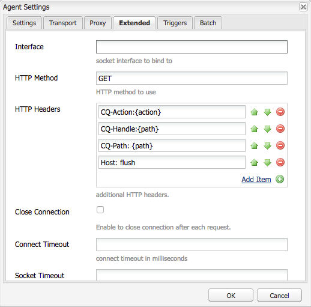

# Purge du Dispatcher Adobe Managed Services


Découvrez les nuances des mécanismes de purge du cache et des workflows d’activation du contenu, essentiels pour préserver l’efficacité du système et l’intégrité des données.

## Description {#description}


### Environnements

Experience Manager

### Problème/Symptômes

Ce document explique comment la purge se produit et le mécanisme qui exécute la purge du cache et l’invalidation.

### Fonctionnement

#### Ordre des opérations

Le workflow type est mieux décrit lorsque les auteurs de contenu activent une page. Lorsque l’éditeur reçoit le nouveau contenu, il déclenche une demande de purge au répartiteur, comme illustré dans le diagramme suivant :


Cet enchaînement d’événements souligne que nous ne vidons les éléments que lorsqu’ils sont nouveaux ou ont changé.  Cela permet de s’assurer que le contenu a été reçu par l’éditeur avant d’effacer le cache afin d’éviter les conditions de concurrence dans lesquelles le vidage peut se produire avant que les modifications ne puissent être récupérées auprès de l’éditeur.

#### Agents de réplication

Sur l’instance de création, un agent de réplication est configuré pour indiquer à l’éditeur que lorsqu’un élément est activé, il déclenche l’envoi du fichier et de toutes ses dépendances à l’éditeur.

Lorsque l’éditeur reçoit le fichier, un agent de réplication est configuré pour pointer vers le Dispatcher qui se déclenche sur l’événement à la réception. Il sérialisera ensuite une requête de purge et la publiera dans le Dispatcher.

<b>Agent de réplication de création</b>

Voici quelques exemples de captures d’écran d’un agent de réplication standard configuré :


Il existe généralement 1 ou 2 agents de réplication configurés sur l’auteur pour chaque éditeur vers lequel ils répliquent du contenu.

- Tout d’abord, il s’agit de l’agent de réplication standard qui envoie les activations de contenu à .
- Le second est l&#39;agent inverse.  Cette option est facultative et configurée pour vérifier dans la boîte d’envoi de chaque éditeur s’il existe un nouveau contenu à extraire dans l’auteur en tant qu’activité de réplication inverse.


<b>Événement de réplication de l’éditeur</b>

Voici un exemple de captures d’écran d’un agent de réplication de purge standard configuré :


<b>Réplication de purge du Dispatcher recevant l’hôte virtuel</b>

Le module de Dispatcher recherche des en-têtes particuliers à connaître lorsqu’une demande de POST doit être transmise aux rendus AEM ou s’il s’agit d’une demande sérialisée en tant que demande de purge et qui doit être traitée par le gestionnaire de Dispatcher lui-même. Voici une capture d’écran de la page de configuration qui affiche ces valeurs :


La page des paramètres par défaut affiche la variable <b>Type de sérialisation</b> as *Purge du Dispatcher* et définit le niveau d’erreur :


Sur le <b>Transport</b> vous pouvez voir l’URI en cours de définition pour pointer l’adresse IP du dispatcher qui recevra les requêtes de purge. Chemin d’accès `/dispatcher/invalidate.cache` n’est pas la manière dont le module détermine s’il s’agit d’une purge ; c’est seulement un point de terminaison évident que vous pouvez voir dans le journal d’accès pour savoir qu’il s’agissait d’une requête de purge. Sur le <b>Étendu</b> , nous allons passer en revue les éléments qui sont présents pour vérifier qu’il s’agit d’une demande de vidage envoyée au module dispatcher.



La méthode HTTP pour les requêtes de vidage est simplement une requête GET avec certains en-têtes de requête spéciaux :

- <b>CQ-Action</b>\
  Elle utilise une variable AEM basée sur la requête et la valeur est généralement activée ou supprimée.
- <b>CQ-Handle</b>\
  Cette opération utilise une variable AEM basée sur la requête et la valeur est généralement le chemin d’accès complet à l’élément vidé, par exemple /content/dam/logo.jpg
- <b>CQ-Path</b>\
  Cette opération utilise une variable d’AEM basée sur la requête et la valeur est généralement le chemin d’accès complet à l’élément en cours de purge, par exemple /content/dam .
- <b>Hôte</b>\
  C’est là que l’en-tête de l’hôte est mis en file d’attente pour cibler un `<` VirtualHost`>`  qui est configuré sur le serveur web Apache du dispatcher (/etc/httpd/conf.d/enabled_vhosts/aem_flush.vhost). Il s’agit d’une valeur codée en dur qui correspond à une entrée dans ServerName ou ServerAlias du fichier aem_flush.vhost.


Sur le <b>Triggers</b> Nous prendrons note des déclencheurs activés que nous utilisons et de ce qu’ils sont

- <b>Ignorer la valeur par défaut</b>\
  Cette option est activée de sorte que l’agent de réplication ne soit pas déclenché lors de l’activation d’une page. Lorsqu’une instance d’auteur modifie une page, cela déclenche une purge. Parce qu&#39;il s&#39;agit d&#39;un éditeur, nous ne voulons pas déclencher ce type d&#39;événement.
- <b>À réception</b>\
  Lorsqu’un nouveau fichier est reçu, nous voulons déclencher une purge. Ainsi, lorsque l’auteur nous envoie un fichier mis à jour, nous déclenchons et envoyons une demande de purge au dispatcher.
- <b>Aucun contrôle de version</b>\
  Nous vérifions cela pour éviter que l’éditeur ne génère de nouvelles versions, car un nouveau fichier a été reçu. Nous allons simplement remplacer le fichier que nous avons et nous fier à l&#39;auteur pour garder une trace des versions au lieu de l&#39;éditeur.


Maintenant, si nous regardons à quoi ressemble une requête de purge standard sous la forme d’une commande curl


```
$ curl \
-H "CQ-Action: Activate" \
-H "CQ-Handle: /content/dam/logo.jpg" \
-H "CQ-Path: /content/dam/" \
-H "Content-Length: 0" \ 
-H "Content-Type: application/octect-stream" \
-H "Host: flush" \
http://10.43.0.32:80/dispatcher/invalidate.cache
```


Cet exemple de vidage vide `/content/dam` en mettant à jour le chemin d’accès `.stat` dans ce répertoire.

#### Le fichier .stat

Le mécanisme de purge est simple par nature et nous voulons expliquer l&#39;importance de <b>.stat</b> fichiers générés à la racine du document dans laquelle les fichiers de cache sont créés.

Dans le `.vhost` et `_farm.any` , nous configurons une directive racine de document pour spécifier l’emplacement du cache et l’emplacement de stockage/service des fichiers lorsqu’une demande d’un utilisateur final arrive.

Si vous deviez exécuter la commande suivante sur votre serveur Dispatcher, vous commenceriez à trouver `.stat` fichiers .

`$ find /mnt/var/www/html/ -type f -name ".stat"`

Voici un diagramme de l’apparence de cette structure de fichiers lorsque vous avez des éléments dans le cache et qu’une demande de purge a été envoyée et traitée par le module de Dispatcher :


<b>Niveau du fichier de début</b>

Notez que dans chaque répertoire, un fichier .stat était présent. Il s’agit d’un indicateur indiquant qu’une purge a eu lieu.  Dans l’exemple ci-dessus, <b>niveau de fichier stat</b> a été défini sur <b>3</b> dans le fichier de configuration de ferme correspondant.

Le paramètre stat file level indique le nombre de dossiers que le module va parcourir en profondeur et met à jour un fichier .stat. Le fichier .stat est vide. Il ne s’agit rien de plus qu’un nom de fichier avec un horodatage et peut même être créé manuellement, mais il exécute la commande tactile sur la ligne de commande du serveur du répartiteur.

Si le paramètre de niveau de fichier stat est défini sur une valeur trop élevée, chaque requête de purge traverse l’arborescence de répertoires pour toucher les fichiers .stat.  Cela peut devenir un accès aux performances majeur sur les grandes arborescences du cache et avoir une incidence sur les performances globales de votre dispatcher.

Si vous définissez ce niveau de fichier sur une valeur trop basse, une requête de purge peut effacer plus que prévu. De ce fait, le cache se déclencherait plus souvent, avec moins de requêtes diffusées à partir du cache, ce qui pourrait entraîner des problèmes de performances.

<b>Remarque :</b> Définissez le niveau du fichier stat à un niveau raisonnable.  Examinez la structure de vos dossiers et assurez-vous qu’elle est configurée pour permettre des vidages concis sans avoir à parcourir trop de répertoires. Testez-le et assurez-vous qu’il correspond à vos besoins lors d’un test de performance du système.

Un bon exemple est un site qui prend en charge les langues. L’arborescence de contenu classique contiendra les répertoires suivants : `/content/brand1/en/us/`

Dans cet exemple, utilisez un paramètre de niveau fichier stat de 4. Cela vous assure lorsque vous videz du contenu qui se trouve sous la balise <b>us</b> pour empêcher le vidage des dossiers de langue.

<b>Prise en main de l’horodatage du fichier de démarrage</b>

Lorsqu’une demande de contenu se produit dans la même routine :

1. L’horodatage du fichier .stat est comparé à l’horodatage du fichier demandé.
2. Si le fichier .stat est plus récent que le fichier demandé, il supprime le contenu mis en cache et en récupère un nouveau dans AEM et le met en cache. Il diffuse ensuite le contenu.
3. Si le fichier .stat est plus ancien que le fichier demandé, il sait que le fichier est neuf et peut servir le contenu.


<b><u>Handshake du cache : exemple `[` 1`]` </u></b>

Dans l’exemple ci-dessus, une requête pour le contenu /content/index.html

L&#39;heure du fichier index.html est 2019-11-01 à 18h21

L’heure du fichier .stat le plus proche est 2019-11-01 @ 22h22

En comprenant ce que nous avons lu ci-dessus, vous pouvez constater que le fichier d’index est plus récent que le fichier .stat et que le fichier est transmis du cache à l’utilisateur final qui l’a demandé.

<b><u>Handshake du cache : exemple `[` 2`]` </u></b>

Dans l’exemple ci-dessus, une requête pour le contenu /content/dam/logo.jpg

L’heure du fichier logo.jpg est 2019-10-31 à 13h13.

L’heure du fichier .stat le plus proche est 2019-11-01 @ 22h22

Comme vous pouvez le voir dans cet exemple, le fichier est plus ancien que le fichier .stat et sera supprimé et un nouveau fichier extrait de l’AEM pour le remplacer dans le cache avant d’être envoyé à l’utilisateur final qui l’a demandé.

### Paramètres du fichier de ferme

La documentation est disponible ici pour l’ensemble des options de configuration :[Guide de configuration AEM Dispatcher](https://experienceleague.adobe.com/en/docs/experience-manager-dispatcher/using/configuring/dispatcher-configuration#configuring-dispatcher_configuring-the-dispatcher-cache-cache)

Nous allons mettre en évidence quelques-uns d’entre eux qui se rapportent à la purge du cache.

#### Racine du document

Cette entrée de configuration se trouve dans la section suivante du fichier de ferme :


```
/myfarm {
    /cache {
        /docroot
```


Vous spécifiez le répertoire dans lequel vous souhaitez que Dispatcher soit renseigné et géré en tant que répertoire de cache.

<b>Remarque : </b>Ce répertoire doit correspondre au paramètre racine du document Apache pour le domaine que votre serveur web est configuré pour utiliser.

Avoir des dossiers docroot imbriqués pour chaque ferme qui vivent des sous-dossiers de la racine du document apache est une idée terrible pour de nombreuses raisons.

#### Niveau de fichier d’état

Cette entrée de configuration se trouve dans la section suivante du fichier de ferme :


```
/myfarm {
    /cache {
        /statfileslevel
```


Ce paramètre évalue la profondeur de génération des fichiers .stat lorsqu’une requête de purge entre en jeu.

La variable `/statfileslevel` définissez sur le nombre suivant avec la racine du document de `/var/www/html/` aurait les résultats suivants lors de la purge `/content/dam/brand1/en/us/logo.jpg`

- 0 - Les fichiers .stat suivants seraient créés :
   - /var/www/html/.stat
- 1 - Les fichiers .stat suivants seraient créés :
   - /var/www/html/.stat
   - /var/www/html/content/.stat
- 2 - Les fichiers .stat suivants seraient créés :
   - /var/www/html/.stat
   - /var/www/html/content/.stat
   - /var/www/html/content/dam/.stat
- 3 - Les fichiers .stat suivants seraient créés :

   - /var/www/html/.stat
   - /var/www/html/content/.stat
   - /var/www/html/content/dam/.stat
   - /var/www/html/content/dam/brand1/.stat
- 4 - Les fichiers .stat suivants seraient créés :

   - /var/www/html/.stat
   - /var/www/html/content/.stat
   - /var/www/html/content/dam/.stat
   - /var/www/html/content/dam/brand1/.stat
   - /var/www/html/content/dam/brand1/en/.stat
- 5 - Les fichiers .stat suivants seraient créés :

   - /var/www/html/.stat
   - /var/www/html/content/.stat
   - /var/www/html/content/dam/.stat
   - /var/www/html/content/dam/brand1/.stat
   - /var/www/html/content/mac/brand1/en/.stat
   - /var/www/html/content/mac/brand1/fr/us/.stat


<b>Remarque :</b>Gardez à l’esprit que lorsque la poignée de main d’horodatage se produit, il recherche le fichier .stat le plus proche.

Disposer d’un fichier .stat de niveau 0 et d’un fichier stat uniquement à l’adresse `/var/www/html/.stat` signifie que le contenu qui vit sous `/var/www/html/content/dam/brand1/en/us/` Recherchez le fichier .stat le plus proche et recherchez 5 dossiers pour trouver le seul fichier .stat existant au niveau 0 et comparer des dates à cela. Cela signifie qu’une purge à ce niveau élevé invaliderait essentiellement tous les éléments mis en cache.

#### Invalidation autorisée

Cette entrée de configuration se trouve dans la section suivante du fichier de ferme :


```
/myfarm {
    /cache {
        /allowedClients {
```


Dans cette configuration, vous placez une liste d’adresses IP autorisées à envoyer des requêtes de purge. Si une requête de purge entre dans le Dispatcher, elle doit provenir d’une adresse IP de confiance. Si vous avez mal configuré ou si vous envoyez une requête de purge à partir d’une adresse IP non approuvée, l’erreur suivante s’affichera dans le fichier journal :


```
[ Mon Nov 11 22:43:05 2019]  [ W]  [ pid 0000 (tid 139859875000000)]  Flushing rejected from 00.00.0.00
```


#### Règles d’invalidation

Cette entrée de configuration se trouve dans la section suivante du fichier de ferme :


```
/myfarm {
    /cache {
        /invalidate {
```


Ces règles indiquent généralement quels fichiers peuvent être invalidés avec une requête de purge.

Pour éviter que des fichiers importants ne soient invalidés avec l’activation d’une page, vous pouvez appliquer des règles qui spécifient quels fichiers peuvent être invalidés et lesquels doivent être invalidés manuellement. Voici un exemple de configuration qui autorise uniquement l’invalidation des fichiers HTML :


```
/invalidate {
   /0000 { /glob "*" /type "deny" }
   /0001 { /glob "*.html" /type "allow" }
}
```


## Résolution {#resolution}


### Tests/dépannage

Lorsque vous activez une page et que vous obtenez le feu vert indiquant que l’activation de la page a réussi, vous devez vous attendre à ce que le contenu que vous avez activé soit également vidé du cache.

Vous actualisez votre page et voyez les anciennes choses et il y a le feu vert.

Suivons quelques étapes manuelles du processus de purge pour nous donner une idée de ce qui pourrait être mauvais.  Dans le shell de l’éditeur, exécutez la requête de purge suivante à l’aide de curl :


```
$ curl -H "CQ-Action: Activate" \
-H "CQ-Handle: /content/<PATH TO ITEM TO FLUSH>" \
-H "CQ-Path: /content/<PATH TO ITEM TO FLUSH>" \
-H "Content-Length: 0" -H "Content-Type: application/octet-stream" \
-H "Host: flush" \
http://<DISPATCHER IP ADDRESS>/dispatcher/invalidate.cache
```


Exemple de requête de purge de test :


```
$ curl -H "CQ-Action: Activate" \
-H "CQ-Handle: /content/customer/en-us" \
-H "CQ-Path: /content/customer/en-us" \
-H "Content-Length: 0" -H "Content-Type: application/octet-stream" \
-H "Host: flush" \
http://169.254.196.222/dispatcher/invalidate.cache
```


Une fois que vous avez déclenché la commande de requête vers le Dispatcher, vous souhaiterez voir ce qui est fait dans les journaux et ce qui est fait avec les fichiers .stat. Suivez le fichier journal et vous devriez voir les entrées suivantes pour confirmer que la demande de purge a atteint le module de Dispatcher.


```
[ Wed Nov 13 16:54:12 2019]  [ I]  [ pid 19173:tid 140542721578752]  Activation detected: action=Activate [ /content/dam/logo.jpg] 
[ Wed Nov 13 16:54:12 2019]  [ I]  [ pid 19173:tid 140542721578752]  Touched /mnt/var/www/html/.stat
[ Wed Nov 13 16:54:12 2019]  [ I]  [ pid 19173:tid 140542721578752]  Touched /mnt/var/www/html/content/.stat
[ Wed Nov 13 16:54:12 2019]  [ I]  [ pid 19173:tid 140542721578752]  Touched /mnt/var/www/html/content/dam/.stat
[ Wed Nov 13 16:54:12 2019]  [ I]  [ pid 19173:tid 140542721578752]  "GET /dispatcher/invalidate.cache" 200 purge [ publishfarm/-]  0ms
```


Maintenant que le module est récupéré et que la demande de vidage a été acquittée, nous devons voir comment il a affecté les fichiers .stat. Exécutez la commande suivante et observez la mise à jour des horodatages lorsque vous lancez une autre purge :


```
$ watch -n 3 "find /mnt/var/www/html/ -type f -name ".stat" | xargs ls -la $1"
```


Comme vous pouvez le voir à partir de la sortie de la commande, les horodatages des fichiers .stat actuels


```
-rw-r--r--. 1 apache apache 0 Nov 13 16:54 /mnt/var/www/html/content/dam/.stat
-rw-r--r--. 1 apache apache 0 Nov 13 16:54 /mnt/var/www/html/content/.stat
-rw-r--r--. 1 apache apache 0 Nov 13 16:54 /mnt/var/www/html/.stat
```


Maintenant, si nous réexécutons la purge, vous verrez la mise à jour des horodatages.


```
-rw-r--r--. 1 apache apache 0 Nov 13 17:17 /mnt/var/www/html/content/dam/.stat
-rw-r--r--. 1 apache apache 0 Nov 13 17:17 /mnt/var/www/html/content/.stat
-rw-r--r--. 1 apache apache 0 Nov 13 17:17 /mnt/var/www/html/.stat
```


Comparons nos horodatages de contenu à ceux de nos fichiers .stat


```
$ stat /mnt/var/www/html/content/customer/en-us/.stat
  File: `.stat'
  Size: 0           Blocks: 0          IO Block: 4096   regular empty file
Device: ca90h/51856d    Inode: 17154125    Links: 1
Access: (0644/-rw-r--r--)  Uid: (   48/  apache)   Gid: (   48/  apache)
Access: 2019-11-13 16:22:31.000000000 -0400
Modify: 2019-11-13 16:22:31.000000000 -0400
Change: 2019-11-13 16:22:31.000000000 -0400
 
$ stat /mnt/var/www/html/content/customer/en-us/logo.jpg
File: `logo.jpg'
  Size: 15856           Blocks: 32          IO Block: 4096   regular file
Device: ca90h/51856d    Inode: 9175290    Links: 1
Access: (0644/-rw-r--r--)  Uid: (   48/  apache)   Gid: (   48/  apache)
Access: 2019-11-11 22:41:59.642450601 +0000
Modify: 2019-11-11 22:41:59.642450601 +0000
Change: 2019-11-11 22:41:59.642450601 +0000
```


Si vous examinez l’un des horodatages, vous remarquerez que le contenu a une heure plus récente que le fichier .stat qui indique au module de servir le fichier à partir du cache, car il est plus récent que le fichier .stat.

En clair, quelque chose a mis à jour les horodatages de ce fichier qui ne le qualifient pas pour être &quot;purgé&quot; ou remplacé.
