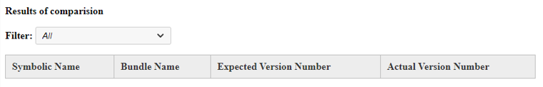

# Experience Manager - Comment valider la version du bundle OSGi après les mises à jour ?

## Description {#description}

<b>Environnement</b>
Adobe Experience Manager

<b>Problème/Symptômes</b>
Comment vérifier la version du lot OSGi après une mise à jour pour confirmer la réussite de l’installation ?

## Résolution {#resolution}

<b>Étapes à résoudre</b>
1. Copier/coller le fichier JSON à partir de <b>*http://aemhost1:port/*system/console/bundles.json</b> au <b>JSON réel</b> Champ de texte.
2. Sélectionner <b>Version du produit</b> de la *version majeure* et *version mineure* menus déroulants pour renseigner automatiquement la variable <b>JSON attendu</b> ou copier/coller JSON d’une autre instance AEM dans le <b>JSON attendu</b> (également à partir de <b>*http://aemhost2:port/*system/console/bundles.json</b>).
3. Cliquez sur <b>Comparer</b> pour afficher la comparaison.\
   

<b>Résultats de la comparaison</b>

1. *Similaire* les lots sont affichés en blanc, *Différents* les versions du lot s’affichent en jaune, *Ajoutée récemment* les lots s’affichent en aqua, et *Supprimé* des lots en rouge clair.
2. Filtrez les données à l’aide du <b>Filtrer</b> de la boîte.\
   

\* Merci à [Sham Sundar Hassan Chikkegowda](https://www.linkedin.com/in/sham-sundar-hassan-chikkegowda-6b03a517) pour fournir l’original [code source](https://github.com/Schikkeg/schikkeg.github.io/blob/master/tools/coi.html) pour cet outil. Son site personnel peut être visité [here](https://www.aemstuff.com/).
