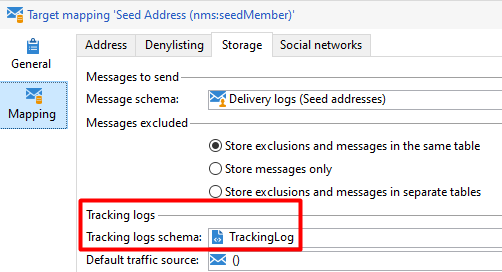

# Le workflow de suivi affiche &quot;Erreur PGS-220000 PostgreSQL : ERROR : erreur &quot;la relation &quot;t1&quot; n’existe pas

## Description


Après un récent upgrade de build 9343 ou supérieur, vous pouvez rencontrer les erreurs suivantes générées par le workflow de suivi :


```
nlmodule    PGS-220000 PostgreSQL error: ERROR:  relation "t1" does not exist LINE 1: ...t, T3.iArticle, T2.iType FROM NmsTrackingUrl T2,  T1 LEFT OU... 
nlmodule    WDB-200001 SQL statement 'SELECT T1.tsLog, T1.iDeliveryId, T1.iUrlId, T1.sSourceType, T3.dAmount, T3.iArticle, T2.iType FROM NmsTrackingUrl T2,  T1 LEFT OUTER JOIN NmsWebTrackingLog T3 ON iTrackingLogId = iWebTrackingLogId WHERE T1.tsLog  :#(1)# AND T1.tsLog = :#(2)#  AND T1.iUrlId=T2.iTrackingUrlId ORDER BY T1.tsLog' could not be executed.   Param(0)=09/17/2020 8:55:00 PM   Param(1)=09/16/2020 8:55:00 PM
nlmodule    Attribute 'broadLog-id' unknown (see definition of schema 'Tracking logs (nms:trackingLog)').
```


## Résolution


Depuis les logs de tracking en mode verbeux, nous constatons que le workflow de tracking échoue à la fin, lors de la consolidation des données :


```
00000000 00000000 1 info log Consolidating tracking logs for the period 09/16/2020 3:55:00 PM, 09/17/2020 3:55:00 PM...
00000000 00000000 1 info wdbc Select: 00000000  SELECT T1.tsLog, T1.iDeliveryId, T1.iUrlId, T1.sSourceType, T3.dAmount, T3.iArticle, T2.iType FROM NmsTrackingUrl T2, T1 LEFT OUTER JOIN NmsWebTrackingLog T3 ON iTrackingLogId = iWebTrackingLogId WHERE T1.tsLog  :#(1)# AND T1.tsLog = :#(2)# AND T1.iUrlId=T2.iTrackingUrlId ORDER BY T1.tsLog
00000000 00000000 2 info wdbc Param(0)=09/17/2020 8:55:00 PM
00000000 00000000 2 info wdbc Param(1)=09/16/2020 8:55:00 PM
00000000 00000000 1 error log PGS-220000 PostgreSQL error: ERROR: relation "t1" does not exist\nLINE 1: ...t, T3.iArticle, T2.iType FROM NmsTrackingUrl T2, T1 LEFT OU...\n \n. (iRc=-2006)
00000000 00000000 1 error log WDB-200001 SQL statement 'SELECT T1.tsLog, T1.iDeliveryId, T1.iUrlId, T1.sSourceType, T3.dAmount, T3.iArticle, T2.iType FROM NmsTrackingUrl T2, T1 LEFT OUTER JOIN NmsWebTrackingLog T3 ON iTrackingLogId = iWebTrackingLogId WHERE T1.tsLog  :#(1)# AND T1.tsLog = :#(2)# AND T1.iUrlId=T2.iTrackingUrlId ORDER BY T1.tsLog' could not be executed.\n Param(0)=09/17/2020 8:55:00 PM\n Param(1)=09/16/2020 8:55:00 PM (iRc=-2006)
```


Chaque fois que le workflow de suivi démarre, il extrait tous les mappings de ciblage et met à jour les données en fonction de la configuration.

Dans ce cas, un mapping de ciblage est à l’origine du problème. Voir ci-dessous :



En gros,<b> NMS : log de tracking</b> Le schéma ne doit PAS être utilisé pour les logs de surveillance, car le schéma n&#39;est pas associé à une table de base de données (SQL).

En conclusion, le problème n’a rien à voir avec la mise à niveau, mais plutôt avec une mauvaise configuration du mapping de ciblage.
