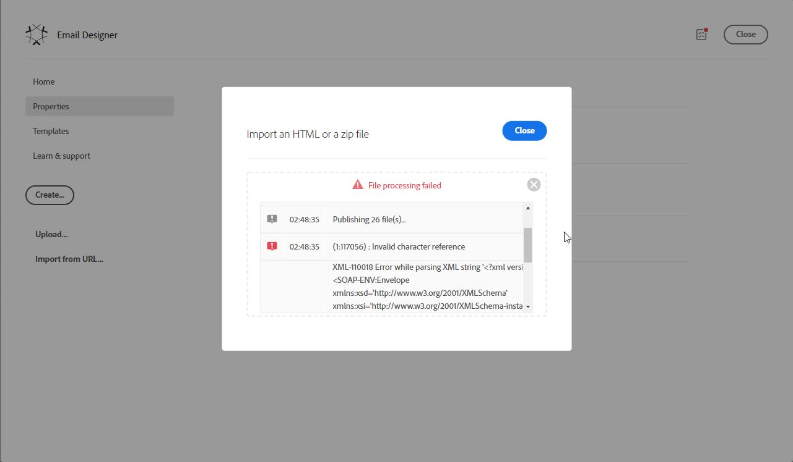

# Erreur lors de l&#39;import de code html dans le Concepteur d&#39;email

## Description

<b>Problème :</b>     Lors d&#39;un import de fichier .zip comportant un fichier de HTML et des images dans le Concepteur d&#39;email, l&#39;erreur ci-dessous s&#39;est produite :     *(1:117056) : Référence de caractère non valide
 XML-110018 Erreur lors de l&#39;analyse de la chaîne XML &#39;?xml version=&#39;1.0&#39;?SOAP-ENV:Envelope xmlns:xsd=&#39;http://www.w3.org/2001/XMLSchema&#39; xmlns:xsi=&#39;http://www.w3.org/2001/XMLSchema-instance&#39; xmlns:ns=&#39;urn:nms:contentModel&#39; xmlns:SOAP-ENV=&#39;http://schemas.xmlsoap.org/soap/envelope/&#39;SOAP-ENV:BodyExtractAndPatchContentResponse xmlns=&#39;urn:nms:contentModel&#39; SOAP-ENV:encodingStyle=&#39;http://schemas.xmlsoap.org/soap/encoding/&#39;pstrContent xsi:type=&#39;xsd:string&#39;&lt;html xmlns=&quot;http://www.w3.org/1999/xhtml&quot; xmlns:v=&quot;urn&lt;span id=&quot; translate=&quot;no&quot; />vm&#39;*     :schemas-microsoft-com:

## Résolution

<b>Motif:</b>

Le fichier de HTML contenait le caractère ASCII 0x03. Une fois le caractère supprimé du fichier de HTML, l’importation a fonctionné.
