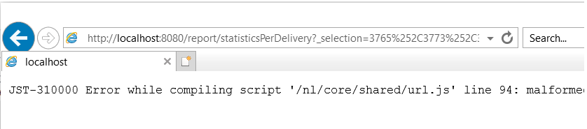

# Les rapports de diffusion ne peuvent pas agréger les statistiques dans ACC en raison de la limitation d’IE.

## Description


Le problème est lié à la longueur maximale de l’URL dans Internet Explorer, qui est de 2 048 caractères : [détails](https://support.microsoft.com/en-us/topic/maximum-url-length-is-2-083-characters-in-internet-explorer-174e7c8a-6666-f4e0-6fd6-908b53c12246).

La source de HTML de la page affiche les rapports dans le client ACC.

Les URL dans la variable `href` attributs de la variable `a` Les balises sont bonnes, c’est-à-dire qu’elles ne sont pas tronquées. Cependant, si une URL est copiée et collée dans IE, le lien sera tronqué à 2 048 caractères et ne pourra pas l’ouvrir :



Il en va de même lorsque vous cliquez avec le bouton droit sur le rapport dans le client ACC et que vous sélectionnez *&quot;Ouvrez dans une nouvelle fenêtre.&quot;* Cela ouvre automatiquement IE, mais la barre d’adresse est vide. Si moins de diffusions sont sélectionnées et que les étapes sont répétées, IE s’ouvre avec l’URL correcte.

Actuellement, un effort est en cours pour remplacer IE par [!DNL Edge]. [!DNL Edge] est basé sur [!DNL Chromium] et ne comporte pas ces restrictions d’URL. Cela a été confirmé en copiant/collant l’URL longue dans [!DNL Edge] qui ne tronque pas l’URL et ouvre le rapport sans problème :


## Résolution


Ce problème doit être résolu automatiquement une fois la transition d’IE vers [!DNL Edge] est terminée. En attendant, la solution suivante peut être déployée :

- Copiez l&#39;URL dans le rapport à partir du client ACC en cliquant avec le bouton droit sur le rapport et en sélectionnant *le raccourci Copier*. Cette opération doit copier l’URL entière dans le Presse-papiers.
- L’URL doit être légèrement modifiée pour pouvoir s’ouvrir dans d’autres navigateurs. L’URL copiée à partir du client suit ce modèle :


```
javascript:switchToReportView(%22statisticsPerDelivery%22,%20%22/report/statisticsPerDelivery?_selection=3765%252C37...
```


- Partie de l’URL commençant par `/report/` doit être copié et ajouté à l’adresse de l’instance. Par exemple : (dans mon cas, l’adresse est localhost) :


```
http://localhost:8080/report/statisticsPerDelivery?_selection=3765%252C3773%252C3781%252C3789%252C3793%252C3769%...
```


- Copiez l’URL résultante dans un autre navigateur : [!DNL Edge], [!DNL Firefox] ou [!DNL Chrome] devraient tous fonctionner correctement.
