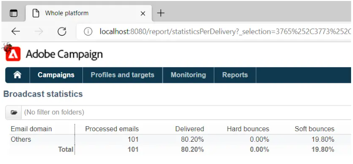

# Rapports de diffusion ne pouvant pas agréger les statistiques dans ACC en raison de la limitation d’IE.


Découvrez comment résoudre le problème du Campaign Classic où la longueur de l’URL dans Internet Explorer (IE) est de 2 048 caractères. Résolvez cela en copiant l’URL vers le rapport à partir de Adobe Campaign Classic (ACC).

## Description {#description}


### Environnement

Adobe Campaign Classic

### Problème/Symptômes

Le problème est lié à la longueur maximale de l’URL dans Internet Explorer, qui est de 2 048 caractères : [détails](https://support.microsoft.com/en-us/topic/maximum-url-length-is-2-083-characters-in-internet-explorer-174e7c8a-6666-f4e0-6fd6-908b53c12246).

La source de HTML de la page affiche les rapports dans la console utilisateur ACC.

Les URL dans la variable `href` attributs de la variable `<` a`>`  Les balises sont bonnes, c’est-à-dire qu’elles ne sont pas tronquées. Cependant, si une URL est copiée et collée dans IE, le lien sera tronqué à 2 048 caractères, et vous ne pourrez pas l’ouvrir :


Il en va de même lorsque vous cliquez avec le bouton droit sur le rapport dans la console utilisateur et que vous sélectionnez *Ouvrir dans une nouvelle fenêtre*. Cela ouvre automatiquement IE, mais la barre d’adresse est vide. Si moins de diffusions sont sélectionnées et que les étapes sont répétées, IE s’ouvre avec l’URL correcte.

Actuellement, un effort est en cours pour remplacer IE par Edge. Edge est basé sur Chromium et ne comporte pas ces restrictions d’URL. Cela a été confirmé en copiant/collant l’URL longue dans Edge, qui ne tronque pas l’URL et ouvre le rapport sans problème :




## Résolution {#resolution}


Ce problème doit être résolu automatiquement une fois la transition d’IE vers Edge terminée. En attendant, la solution suivante peut être déployée :

- Copiez l&#39;URL dans le rapport à partir de la console cliente ACC en cliquant avec le bouton droit sur le rapport et en sélectionnant *le raccourci Copier*. Cette opération doit copier l’URL entière dans le Presse-papiers.
- L’URL doit être légèrement modifiée pour pouvoir s’ouvrir dans d’autres navigateurs. L’URL copiée suit ce modèle :


  ```
  javascript:switchToReportView(%22statisticsPerDelivery%22,%20%22/report/statisticsPerDelivery?_selection=3765%252C37...
  ```


- Partie de l’URL commençant par `/report/` doit être copié et ajouté à l’adresse de l’instance. Dans ce cas, l’adresse est *localhost*:


  ```
  http://localhost:8080/report/statisticsPerDelivery?_selection=3765%252C3773%252C3781%252C3789%252C3793%252C3769%...
  ```


- Copiez l’URL qui en résulte dans un autre navigateur (Edge, Firefox ou Chrome devrait fonctionner correctement).

