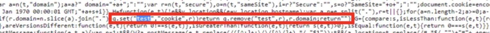

# Adobe Analytics - Qu’est-ce que le cookie &quot;test&quot; dans VisitorAPI.js ?

## Description

Dans le fichier VisitorAPI.js, un cookie portant le nom &quot;test&quot;. Vous vous demandez peut-être à quoi ça sert. Il est simplement écrit sur la page afin de vérifier que les cookies peuvent être écrits sur la page, puis supprimés immédiatement.

## Résolution

- Nom du cookie : Test
- Description : Cookie interne écrit pour tester la prise en charge des cookies du navigateur.
- Durée : Expire immédiatement
- Domaine : Rédigé sur le domaine du site web
- Taille : 2 octets par caractère JS (le cookie écrit une lettre dénuée de sens)
