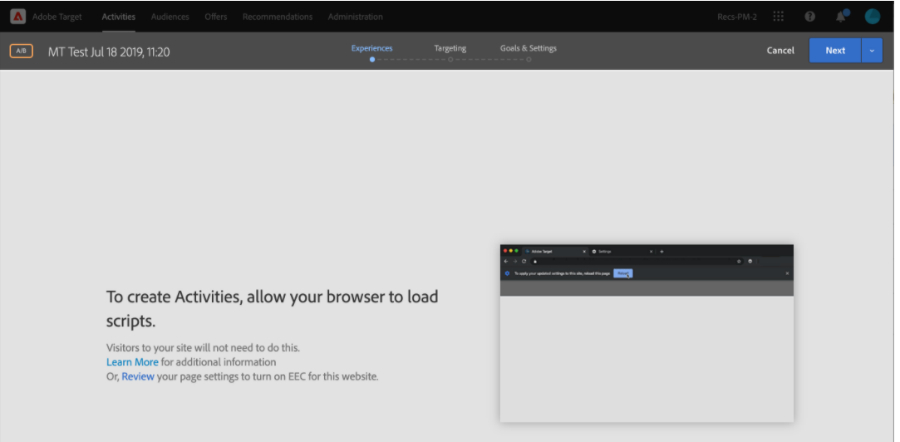

# Débogage/dépannage de Target VEC

## Description

 1. Impossible de charger l’URL de la page dans le VEC cible de l’Adobe.      Voici quelques exemples d’erreurs -   a)      b)       c)   

## Résolution

1. Essayez d’effacer les cookies et les caches ou d’ouvrir votre site web en mode incognito. 
2. Essayez d’utiliser un autre navigateur, par exemple : Mozilla Firefox, Microsoft Edge 3. Dans ce cas d’erreur, installez l’extension de navigateur d’assistance du VEC a) Installez l’extension à partir de [https://chrome.google.com/webstore/detail/adobe-target-vec-helper/ggjpideecfnbipkacplkhhaflkdjagak](https://chrome.google.com/webstore/detail/adobe-target-vec-helper/ggjpideecfnbipkacplkhhaflkdjagak)
b) Pour utiliser l’extension, cliquez sur l’icône d’extension de navigateur de l’assistance du VEC ( ) dans la barre d’outils du navigateur Chrome lors de la consultation du compositeur d’expérience visuelle. 
c) Activez le<b>Injection de bibliothèques cibles</b>&quot; et &quot;cookies&quot; activent &quot;et&quot;.

d) pop-up vous demandant d’autoriser l’extension à ajouter des bibliothèques cibles à la page pour activer la création, que vous devez autoriser.
e) Autoriser le contenu non sécurisé des paramètres du site ([https://experienceleague.adobe.com/docs/target/using/experiences/vec/troubleshoot-composer/mixed-content.html?lang=en](https://experienceleague.adobe.com/docs/target/using/experiences/vec/troubleshoot-composer/mixed-content.html?lang=en))

- Cliquez sur l’icône représentant un verrou (avertissement), puis sur paramètres du site.
- Faites défiler l’écran jusqu’à obtenir du contenu non sécurisé, puis utilisez la liste déroulante pour modifier &quot;Bloc (par défaut)&quot; en &quot;Autoriser&quot;.
- Recharger la page du VEC.

f) Définir le compositeur d’expérience avancé comme désactivé par les étapes suivantes

- Accédez à Target-Administration-VEC- Désactivation de EEC

Remarque : Si le problème persiste, ouvrez la console de développement du navigateur et recherchez un message d’erreur dans cette console.
3. La cible n’est pas prise en charge si le site web contient des iframes à plusieurs niveaux. 

<b>Accès aux pages de post-connexion dans VEC</b>
1. Chargez la page dans VEC et cliquez sur l’onglet &quot;navigateur&quot;, saisissez vos informations d’identification, puis accédez à la page de votre choix. 
2. Cliquez sur l’onglet Composer et effectuez la modification dans VEC. 
OR
1. Ouvrez un site web dans un nouvel onglet et saisissez vos informations de connexion.
2. Ouvrez le VEC dans Target et chargez directement la page après vous être connecté. 
3. Désormais, la page se charge dans VEC pour effectuer la modification.
