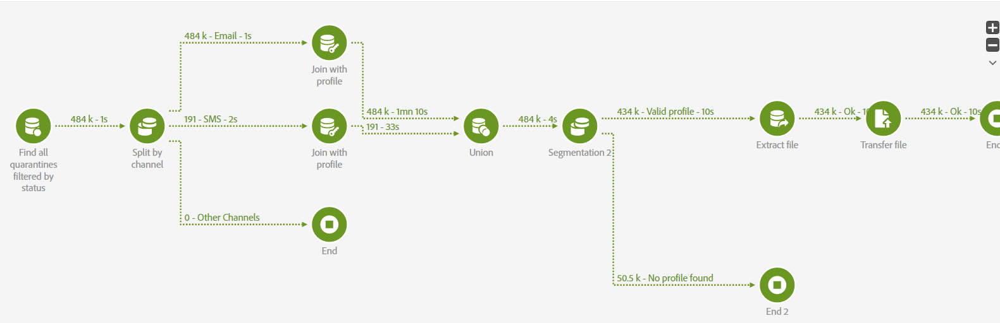

# Comment exporter des quarantaines par pays en Campaign Standard

Cet article explique comment lier les mises en quarantaine aux profils dans Adobe Campaign Standard.

## Description {#description}

### <b>Environnement</b>

Adobe Campaign Standard

### <b>Problème/Symptômes</b>

Comment exporter des quarantaines par pays ?

## Résolution {#resolution}

- Les quarantaines sont dans la table ``NmsAddressStatus``
   - Elles sont liées à la dernière diffusion mais pas à un profil.
   - Ils contiennent l&#39;adresse du destinataire &quot;normalisé&quot; (ex : minuscules pour l&#39;email / préfixe + pour le téléphone mobile).

- Il existe deux options pour les lier à des profils :

1. Rejoindre un profil via le champ adresse sur la page ``AddressStatus`` et Email/mobilePhone sur le profil.
   - Cela ne renverra pas les enregistrements dont l’adresse n’est pas normalisée au niveau du profil.
2. Rejoindre un profil en recherchant tous les logs de diffusion (ils contiennent également une adresse de destinataire normalisée).
   - Cela ne renverra des données que pour les 6 derniers mois et rien pour les hard bounces plus anciens.
   - Cela renverra les profils dont l&#39;adresse du destinataire a déjà été modifiée/corrigée.

