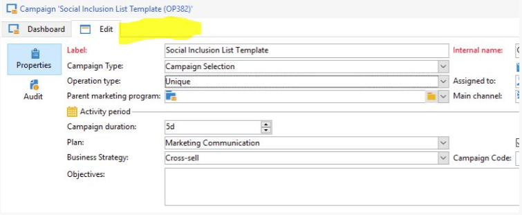

# Impossible d’afficher l’onglet de ciblage et de workflow dans Campaign | Campaign Classic

Découvrez comment afficher l&#39;onglet de ciblage et de workflow dans Campaign Classic en activant les fonctionnalités utilisées dans l&#39;opération.

## Description {#description}

<b>Environnement</b>

Adobe Campaign Classic

<b>Problème/Symptômes</b>

L&#39;onglet &quot;Ciblage et workflow&quot; n&#39;est pas visible dans la campagne. Par exemple :
   

## Résolution {#resolution}

Ce problème se produit car l’option sous les propriétés du modèle de campagne &quot;Fonctionnalités utilisées dans la campagne&quot; n’est pas activée. Pour résoudre ce problème :

- Vérifiez le modèle d&#39;opération associé à l&#39;opération.
- Ouvrez le modèle d&#39;opération.
- Accédez à <b>Modifier</b>, puis cliquez sur <b>Paramètres avancés de l&#39;opération</b>.
- Sous <b>Configuration, s</b>Sélectionnez la valeur Oui par rapport au ciblage et aux workflows.

