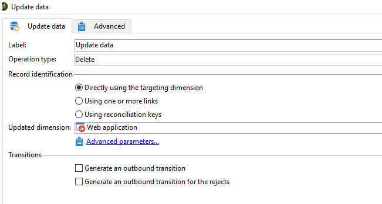

# Erreur lors de la suppression de WebApp : la valeur de clé en double viole la contrainte unique &quot;xtkdictionarystring_name&quot;

## Description {#description}


<b>Environnement</b>

- Adobe Campaign Classic

- Adobe Campaign Classic v7

<b>Problème/Symptômes</b>

Il peut arriver que vous ne parveniez pas à supprimer une application WebApp et que l’erreur suivante se produise :


```
PGS-220000 PostgreSQL error: ERROR: duplicate key value violates unique constraint "xtkdictionarystring_name."
DETAIL: Key (iobjectid, ssourceid, slocale) = (0, del_5818632_closedFormLog, en) already exists.
```


## Résolution {#resolution}


Si vous rencontrez cette erreur dans ACC, la résolution serait de supprimer WebApp via Workflow (comme illustré ci-dessous).

- Créez un nouveau workflow et déposez une activité de requête et de mise à jour sur la zone de travail.

- Interrogez la clé primaire de WebApp et mettez à jour le type d&#39;opération comme suppression dans l&#39;activité de mise à jour de données . Notez qu’une fois l’application supprimée, elle ne peut plus être récupérée tant qu’une restauration de la base de données n’est pas effectuée.



