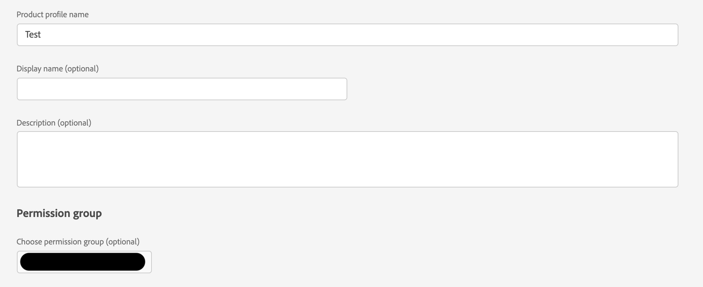

# Impossible de voir AAM option pour lier le groupe AD au groupe AAM

## Description {#description}

<b>Environnement</b>

- Adobe Audience Manager

<b>Problème/Symptômes</b>

Comment synchroniser un profil de produit Admin Console avec un groupe d’autorisations RBAC d’Audience Manager ?

## Résolution {#resolution}

Vous aurez besoin d’un accès administrateur à l’Audience Manager ainsi que d’un accès administrateur de produit dans le Admin Console.

1.) Créez un groupe d’autorisations RBAC dans Audience Manager. Prenez note du nom du groupe d’autorisations choisi :

1.) Accédez au produit Audience Manager dans le Admin Console et créez un profil de produit en sélectionnant le groupe d’autorisations que vous venez de créer dans le menu déroulant :

1.) Ajoutez les utilisateurs appropriés au profil de produit que vous venez de créer :

