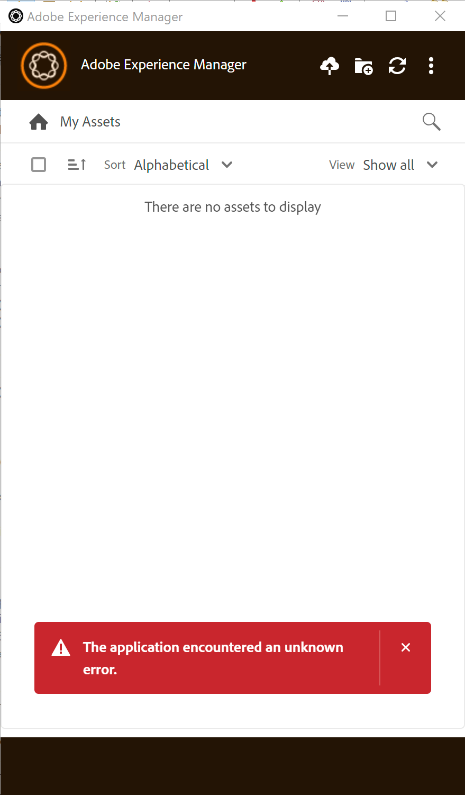

# Application de bureau AEM - L’application a rencontré une erreur inconnue.

## Description {#description}

<b>Environnement</b>
Adobe Experience Manager

<b>Problème</b>
Après avoir installé et configuré l’application AEM Desktop App, procédez comme décrit dans la section [Installation de l’appli de bureau Adobe Experience Manager](https://experienceleague.adobe.com/docs/experience-manager-desktop-app/using/install-upgrade.html?lang=en#install-v2) dans le guide de l’appli de bureau AEM, lors de la connexion à l’instance d’auteur AEM, l’application renvoie l’erreur &quot;*L’application a rencontré une erreur inconnue.*r&quot;.
                

## Résolution {#resolution}

<b>Solution</b>
Le problème est reproductible lors de l’étape 8 de la section [Installation de l’appli de bureau Adobe Experience Manager](https://experienceleague.adobe.com/docs/experience-manager-desktop-app/using/install-upgrade.html?lang=en#install-v2) dans le guide de l’appli de bureau AEM, l’URL <b>http://aem_server:port/assets.html/content/dam</b> est utilisé pour la connexion au référentiel du Experience Manager au lieu de <b>http://aem_server:port</b>.
