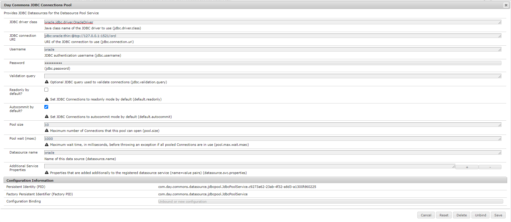

# Comment connecter la base de données Oracle d’AEM as a Cloud Service ?

## Description {#description}

<b>Environnement</b>

Adobe Experience Manager

<b>Problème/Symptômes</b>

Comment connecter la base de données Oracle d’AEM as a Cloud Service ?

## Résolution {#resolution}

La connexion de la base de données Oracle à partir d’AEM as a Cloud Service implique les opérations suivantes :

- Ajout d’une dépendance Maven dans pom

- Service AEM pour se connecter à la base de données Oracle

- Configuration OSGi

<u><b>Ajout d’une dépendance Maven dans pom</b></u>

<b>Étape 1 :</b> Inclure la dépendance maven ci-dessous dans le fichier pom.xml principal de votre projet

Groupe de dépendances : Idcom.oracle.database.jdbc/groupId artifactIdojdbc-bom/artifactId version21.5.0.0/version typom/type scopeimport/scope /dependency

<b>Étape 2 : </b>Insérez la dépendance maven ci-dessous dans &quot;pom.xml&quot; de &quot;core&quot; et &quot;all&quot;.

Groupe de dépendances Idcom.oracle.database.jdbc/groupId artifactIdojdbc8/artifactId /dependency groupIdcom.oracle.database.jdbc/groupId artifactIducp/artifactId /dependency groupIdcom.oracle.database.xml/groupId artifactIddb/artifactId dépendance

<u><b>Service AEM pour se connecter à la base de données Oracle</b></u>

Exemple de code de service pour se connecter à la base de données à partir d’AEM as a Cloud Service. Il peut être inclus dans le chemin 0

{0} - dossier du projet - core - service

<b>DatabaseService.java</b>
 package com.mysite.core.services;  public interface DatabaseService { } 
<b>DatabaseServiceImpl.java</b>
 package com.mysite.core.services;  import com.day.commons.datasource.poolservice.DataSourcePool; import org.osgi.service.component.annotations.Activate; import org.osgi.service.component.annotations.Component; import org.osgi.service.component.annotations.Reference; import org.slf4j.Logger; import org.slf4j.LoggerFactory ;  import javax.sql.DataSource; import java.sql.Connection;  @Component(     service = DatabaseService.class,     immediate = true ) classe publique DatabaseServiceImpl implémente DatabaseService{      private final Logger LOGGER = LoggerFactory.getLogger(DatabaseService.class);      @Reference     private DataSourcePool dataSourcePool;      @Activate     public void activate() {          try {             DataSource dataSource = (DataSource) dataSourcePool.getDataSource(&quot;oracle&quot;);             Connexion = dataSource.getConnection();              if (connexion)= null) {                 if (!connection.isClosed()) {                     LOGGER.info(&quot;Connecté avec la connexion #4&quot;);                     connection.close();                 }             }             else {                 LOGGER.info(&quot;La connexion est nulle&quot;);             }         } catch (Exception ex) {             LOGGER.error(&quot;Il n’était pas possible d’obtenir la source de données : &quot; + ex.getMessage(), ex);         }     } } 
<u><b>Configuration OSGi</b></u>

<b> Étape 1 : </b>Accédez à AEM configuration OSGi (http://localhost:4502/system/console/configMgr) en local.

<b>Étape 2 : </b>Recherchez &quot;JDBC Connection pool&quot; et configurez les valeurs ci-dessous par rapport à votre base de données (voir la capture d’écran pour consulter des exemples de valeurs).

- Classe de pilote JDBC
- URL de connexion JDBC
- Nom d’utilisateur et mot de passe
- Nom de la source de données

<b>Étape 3 : </b>Suivez les étapes du lien ci-dessous et convertissez la configuration OSGi en `.cfg.json` et ajoutez-le à la configuration de votre projet conformément à AEMaaCS Standard.

[https://experienceleague.adobe.com/docs/experience-manager-cloud-service/content/implementing/deploying/configuring-osgi.html?lang=en#generating-osgi-configurations-using-the-aem-sdk-quickstart](https://experienceleague.adobe.com/docs/experience-manager-cloud-service/content/implementing/deploying/configuring-osgi.html?lang=en#generating-osgi-configurations-using-the-aem-sdk-quickstart)

