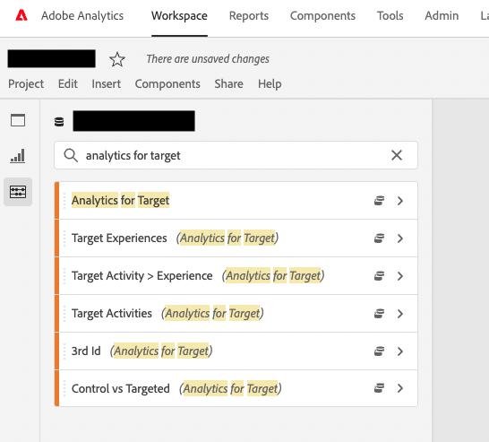

# Autorisation d’affichage des dimensions de rapports A4T dans Adobe Analytics

## Description {#description}

<b>Environnement</b>
- Customer Journey Analytics
- Analytics

<b>Problème/Symptômes</b> Quelles autorisations sont requises pour que les Dimensions d’un rapport A4T s’affichent dans l’Analysis Workspace d’Adobe ?

## Résolution {#resolution}

Suivez les étapes ci-dessous :
1. Tout d’abord, sélectionnez le <b>Profil de produits</b> d’Adobe Analytics auquel vous souhaitez accorder des autorisations via Admin Console.
2. Sélectionner <b>Dimension</b> under <b>Adobe Analytics</b> éléments d’autorisation.\
   
3. Si l’autorisation de dimension <b>Analytics pour Target</b> a été accordé, les éléments de dimension <b>Activités Target</b>, <b>Expériences Target</b>, <b>Activité Target supérieure à l’expérience</b>, <b>Comparaison du contrôle et du ciblage</b>, etc. s’affiche.

- Rapports A4T - Rapports dans Analytics - Dimensions

   https://experienceleague.adobe.com/docs/target/using/integrate/a4t/reporting.html?lang=ja&amp;mt=false#dimensions
- Profils de produit pour Adobe Analytics - Éléments d’autorisation Adobe Analytics

   https://experienceleague.adobe.com/docs/analytics/admin/admin-console/permissions/product-profile.html?lang=eng#dimensions

