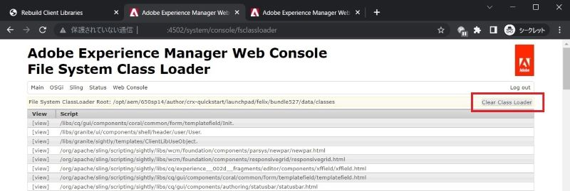

# Adobe Experience Manager : Comment effacer le cache de HTL/JSP/JS/CSS pour les composants personnalisés

## Description

Lorsque vous modifiez des fichiers HTL/JSP/JS/CSS pour votre composant personnalisé, AEM ne reflète pas immédiatement les modifications apportées aux pages avec le composant. Dans ce cas, le cache interne peut être une cause.
Cet article explique comment effacer le cache de ces fichiers.

<b>Environnement :</b>
AEM 6.5

## Résolution

Vous pouvez effacer le cache par les fonctions suivantes.

\* Bibliothèques clientes : Fichiers JS/CSS

Reconstruisez les bibliothèques clientes > Invalider les caches ou reconstruire les bibliothèques http://localhost:4502/libs/granite/ui/content/dumplibs.rebuild.html 
     

\* File System Class Loader : JSP, HTL

Console web > Sling > Chargeur de classe du système de fichiers > Effacer le chargeur de classe http://localhost:4502/system/console/fsclassloader
     

\* Cache de script : HTL, fichier JS

Console web > Sling > État du cache de script > Effacer le cache http://localhost:4502/system/console/scriptcache
     

Il est recommandé d’effacer le cache à un moment calme afin d’éviter une dégradation des performances.
Vous devrez peut-être également vérifier le cache du dispatcher et le cache du navigateur.
