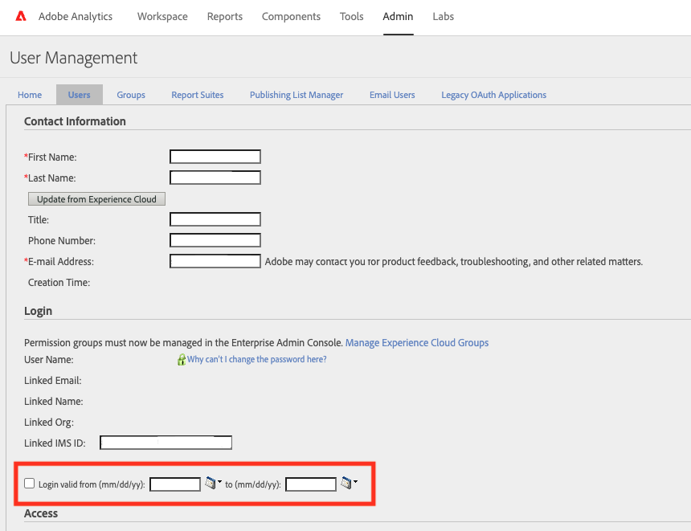

# Impossible d’accéder à Adobe Analytics en raison de &quot;La connexion Analytics a expiré&quot;

## Description {#description}

Un message d’erreur s’affiche ci-dessous lors de l’accès à Adobe Analytics.  
 Analytics Login Expired
 La connexion Analytics a expiré et doit être renouvelée par un administrateur de produit.
    

## Résolution {#resolution}

Cela se produit puisque la date actuelle se trouve en dehors de la période valide pour le compte. Demandez à un administrateur Analytics de votre organisation d’étendre la période de connexion valide. Le service clientèle d’Adobe n’est pas autorisé à modifier les plages de dates de connexion valides pour les comptes d’utilisateurs.

1. En tant qu’administrateur d’Analytics, accédez à Adobe Analytics `>`  Administration `>`  Utilisateurs et ressources Analytics
2. Sélection d’un ID utilisateur en question
3. Dans la fenêtre User Management, étendez la plage de dates valide &#39;Login valid from (mm/jj/yy):&#39; et &#39;to (mm/jj/yy):&#39;. Vous pouvez également décocher la case.

・Connexions expirées
[https://experienceleague.adobe.com/docs/analytics/technotes/troubleshoot-login.html?lang=en#expired-logins](https://experienceleague.adobe.com/docs/analytics/technotes/troubleshoot-login.html?lang=en#expired-logins)
