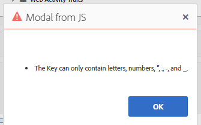

# Erreur lors de la création d’une caractéristique à partir du tableau de bord des signaux

## Description

Lors de la création de caractéristiques à partir de signaux présents dans le tableau de bord Signals (Signaux), l’erreur suivante s’affiche :

Le signal que j’essaie d’utiliser est le suivant :

## Résolution

L’erreur indiquée indique que la touche du signal ne peut contenir que des guillemets doubles (&quot;), des points (.), des tirets (-) et des traits de soulignement (_).

En examinant les signaux de plus près, il a été identifié qu’il contient un espace comme indiqué ci-dessous en raison de l’échec de la validation des caractéristiques.

Il est très important de sélectionner la condition de signal correcte.

Références :

Règles de caractéristiques - [https://experienceleague.adobe.com/docs/audience-manager/user-guide/features/traits/trait-builder/manage-trait-rules.html?lang=en](https://experienceleague.adobe.com/docs/audience-manager/user-guide/features/traits/trait-builder/manage-trait-rules.html?lang=en)

Exigences de nom - [https://experienceleague.adobe.com/docs/audience-manager/user-guide/features/traits/trait-key-name-requirements.html?lang=en](https://experienceleague.adobe.com/docs/audience-manager/user-guide/features/traits/trait-key-name-requirements.html?lang=en)
