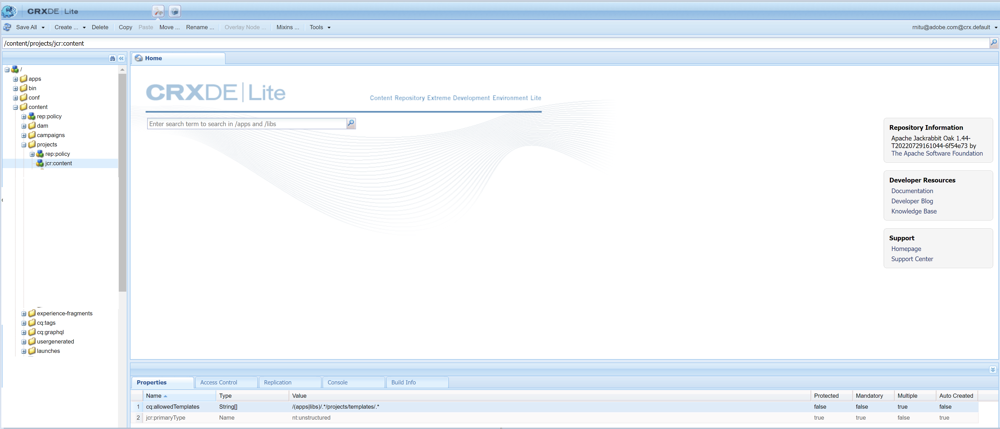

# Aucun modèle de projet disponible

## Description

Bien que l’utilisateur du client dispose de tous les privilèges nécessaires affectés dans le Admin Console, y compris les droits d’administrateur, lors de la tentative de création d’un projet à partir de *AEM Démarrage - Projets - Créer - Projet* aucun modèle de projet n’est disponible par conséquent, aucun projet ne peut être créé.   
Selon 1, AEM est livré avec trois modèles d&#39;usine différents :

- Un projet simple : un modèle de référence pour tous les projets auxquels les autres catégories ne sont pas adaptées. Il comprend trois rôles de base (propriétaires, éditeurs et observateurs) et quatre workflows (Approbation de projet, Demander un lancement, Demander la page d’entrée et Demander un courrier électronique).
- Un projet de média : un modèle de référence pour des activités multimédias. Il comprend plusieurs rôles de projet liés aux médias (photographes, éditeurs, rédacteurs, concepteurs, propriétaires et observateurs).
- A [projet de traduction](https://experienceleague.adobe.com/docs/experience-manager-cloud-service/content/sites/administering/reusing-content/translation/overview.html?lang=en) - Un exemple de référence pour la gestion des activités liées à la traduction. Il prévoit trois rôles de base (propriétaires, éditeurs et observateurs). Il comprend deux workflows accessibles dans l’interface utilisateur Workflows.

      Cependant, le client ne peut voir aucun de ces modèles.     1 [https://experienceleague.adobe.com/docs/experience-manager-cloud-service/content/sites/authoring/projects/overview.html?lang=en#project-templates](https://experienceleague.adobe.com/docs/experience-manager-cloud-service/content/sites/authoring/projects/overview.html?lang=en#project-templates)

## Résolution

Pour que les modèles de projet soient visibles dans AEM, la propriété - <b>cq:allowedTemplates</b> de type <b>Chaîne</b> et la valeur <b>/(apps|libs)/.\*/projects/templates/.\&lt;/b>* doit être présent sous <b>/content/projects/jcr:content</b>.

Il a été découvert que le problème était dû au fait que le client n’avait pas de noeud jcr:content sous /content/projects. Après avoir créé le noeud jcr:content et ajouté l’attribut cq:allowedTemplates , le client pouvait voir les trois modèles de projet.

