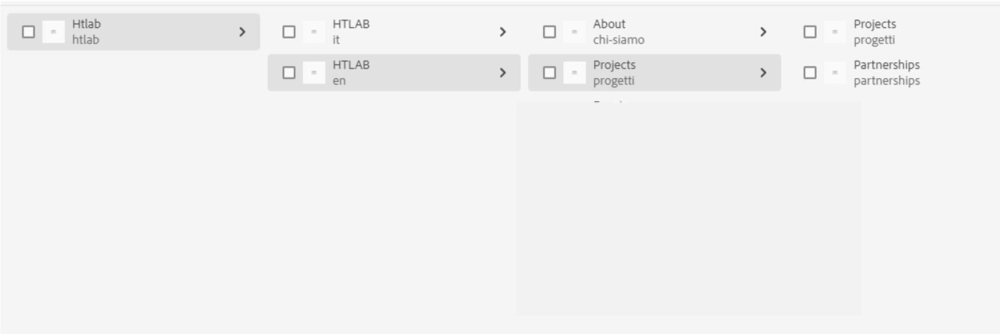

# Contenu incorrect affiché sur la page publiée

Pour résoudre le problème, suivez les étapes de cet article pour supprimer le *projects*&quot; à partir du référentiel de l’éditeur, ainsi que le &quot; incorrect&quot; ;*partenariats*&quot; un.

## Description {#description}

<b>Environnement</b>
Adobe Experience Manager (AEM)

<b>Problème</b>
Le site client avait deux branches de langue - l&#39;italien (it) et l&#39;anglais (en) - avec le même contenu, la branche anglaise étant une Live Copy de l&#39;italien.

L’anglais &quot;*projects*&quot; la page portait le nom &quot;*progetti*&quot;, mais il avait également un alias défini sur &quot;*projects*&quot;, il aurait donc dû être accessible à l’adresse http://`<` Éditeur`>` .`<` URL`>` /content/htlab/en/progetti.html et http://`<` Éditeur`>` .`<` URL`>` /content/htlab/en/projects.html.
Toutefois, uniquement lorsqu’il est accessible via &quot;*progetti*&quot;les enfants appropriés étaient affichés sous forme de liens accessibles dans la page - &quot;*projects*&quot; et &quot;*partenariats*&quot;.

Chaque fois qu’il est accessible via &quot;*projects*&quot;, les enfants affichés étaient &quot;*projects*&quot; et une page incorrecte &quot;*partenariats*&quot;, bien que cette page n’ait pas été présente dans l’auteur.

## Résolution {#resolution}

Dans le référentiel de l’éditeur, en plus du &quot;*progetti*&quot;, il y avait également une page nommée &quot;*projects*&quot; qui contient la mauvaise page &quot;*partenariats*&quot; enfant.
Peut-être qu&#39;à un moment donné, il a été créé puis supprimé sans être publié, et il a également été mis en cache.
Le problème a été corrigé après la suppression de l’intégralité de &quot;*Projets*&quot; sous en et procédez comme suit :

1. Créer une Live Copy de l’italien &quot;*progetti*&quot; sans inclure ses enfants et avec les propriétés : Nom : projects ; titre : Projects
2. Créez des Live Copies pour les enfants du *progetti*&quot; page comme ci-dessous : - pour &quot;*progetti*&quot;, créez une Live Copy avec le nom &quot;projets&quot; et le titre &quot;Projets&quot; - pour &quot;*partenariats*&quot;créer une Live Copy avec le nom &quot;partenariat&quot; et le titre &quot;partenariat&quot;
3. Publier les pages nouvellement créées
4. Annuler la publication des pages
5. Supprimez l’intégralité de &quot;p&quot;*projets*&quot; à nouveau.

Ainsi, le &quot;*projects*&quot; a également été supprimée du référentiel de l’éditeur avec le &quot; incorrect&quot;.*partenariats*&quot; un.
