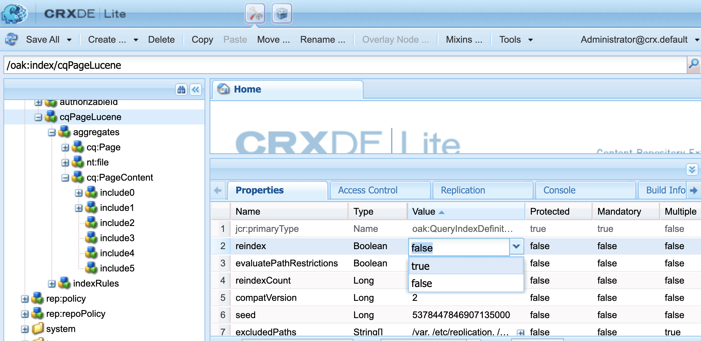

# Les liens entrants n’affichent pas toutes les pages de liaison dans Adobe Experience Manager


Si un noeud comportant un lien se trouve à plus de quatre niveaux à partir du jcr:content de sa page, la page ne s’affiche pas dans les liens entrants de la cible du lien dans Adobe Experience Manager. Lisez cet article pour savoir pourquoi cela se produit.

## Description {#description}


### <b>Environnement</b>

- Adobe Experience Manager as a Cloud Service
- Adobe Experience Manager 6.5


### <b>Problèmes/symptômes</b>

Si un noeud comportant un lien se trouve à plus de quatre niveaux à partir du jcr:content de sa page, la page ne s’affiche pas dans les liens entrants de la cible du lien.

・ Lorsqu’une page de liaison s’affiche dans les liens entrants :
  /content/wknd/us/en/link-page/jcr:content
  1) /root
  2) /container
  3) /container
  4) /text(link)

・ Lorsqu’une page de liaison ne s’affiche pas dans les liens entrants :
  /content/wknd/us/en/link-page/jcr:content
  1) /root
  2) /container
  3) /container
  4) /container
  5) /text(link)


## Résolution {#resolution}


Vérifiez la hiérarchie des nœuds qui contiennent le lien à l’aide de CRXDE Lite.


Examinez la structure de la page et ajustez-la afin que le nœud du lien puisse être situé à un niveau peu profond.
Si le niveau du nœud de liaison reste profond, ajustez un index afin d’augmenter le niveau à indexer pour la recherche des liens entrants.

À l’aide de CRX/DE Lite, sélectionnez


```
/oak:index/cqPageLucene/aggregates/cq:PageContent.
```

Créez un nœud et ajoutez une propriété « path » qui exprime le niveau de hiérarchie requis.
- Dans l’exemple ci-après, &#39;include4&#39; et &#39;include5&#39; sont ajoutés pour augmenter le niveau de recherche des liens entrants jusqu’à 6.


Pour effectuer la réindexation, définissez la valeur de la propriété reindex de `/oak:index/cqPageLucene` sur true et enregistrez-la.


  
    - Une fois la réindexation terminée, le message ci-après apparaît dans error.log.

`    13.01.2023 12:00:45.264 *INFO* [ async-index-update-async]  org.apache.jackrabbit.oak.plugins.index.AsyncIndexUpdate [ async]  Reindexing completed for indexes: [ /oak:index/cqPageLucene*(788)]  in 733.7 ms (733 ms)`

La réindexation peut entraîner un problème de performances.
    Il est recommandé de planifier la tâche de réindexation pendant une période relativement calme.
