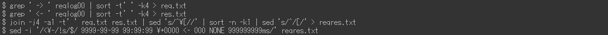

# Adobe Experience Manager : Exemples d’analyse de request.log

## Description {#description}

Le fichier request.log d’AEM contient diverses informations utiles, telles que le temps de réponse, pour l’analyse des problèmes de performances. Voici une liste d’exemples d’analyse utilisant des commandes Linux (dont certaines commandes externes).

<b>Environnements</b>
AEM 6.5, Linux (Bash)

## Résolution {#resolution}

<b>Table des matières:</b>

Introduction Format de request.log

Étape 1 de préparation. Nettoyage des données : étape 2. Temps redémarré Étape 3. Nombre d’accès par heure Étape 4. Étape 5 du traitement simultané maximum. Fractionner un fichier journal : Étape 6. Fusionner les enregistrements de requête et les enregistrements de réponse

Exemples d’analyse Exemple 1. Exemple 2 : accès le plus élevé. Accès à la réponse manquante Exemple 3. Exemple 4 : accès lent. Données de série temporelle du temps de réponse Exemple 5. Minimum, moyenne (moyenne), médiane, temps de réponse maximal Exemple 6. Nombre d’accès par période Exemple 7. Nombre d’états de réponse par période Exemple 8. URL les plus fréquentes Exemple 9. enregistrements access.log pour un enregistrement request.log

Conclusion

<b>Introduction</b>

<u>Format de request.log</u>

AEM 6.5 génère request.log au format suivant par défaut. En raison d’une limitation du système, les lignes de commande de cet article s’affichent sous forme d’images au lieu de texte brut.

Exemple de request.log :

Dans cet article, je fais référence à une ligne avec &quot;-&quot; comme &quot;enregistrement de demande&quot;. Une ligne avec &quot;-&quot; est un &quot;enregistrement de réponse&quot;.

Enregistrement de requête Lorsqu’une requête est reçue par AEM, un enregistrement de requête est consigné. Il contient la date et l’heure de réception, l’identifiant de la demande, la méthode de demande et l’URL.

Enregistrement de réponse Lorsque AEM répond à une requête, un enregistrement de réponse est consigné. Il contient la date et l’heure de la réponse, l’ID de la requête, le code d’état, le type de contenu et le temps de réponse (en millisecondes).

Consultez également le manuel correspondant : https://experienceleague.adobe.com/docs/experience-manager-65/deploying/configuring/monitoring-and-maintaining.html?lang=en#interpreting-the-request-log

<b>Préparation</b>

<u>Étape 1. Nettoyage des données</u>

Avant de passer à l’analyse de request.log, il est important de normaliser les enregistrements de journal.

La première commande utilisée supprime un espace supplémentaire dans les enregistrements de réponse Content-Type, afin d’éviter une séparation de champ incorrecte avec l’espace blanc. La commande ruby convertit le format de date en ISO 8601. La commande ruby sépare également la date et l’heure par un espace blanc au lieu d’un deux-points.

<u>Étape 2. Temps redémarré</u>

Le redémarrage d’AEM et d’une installation de Service Pack réinitialise l’ID de requête de request.log. Les enregistrements de requête avec ID de requête = 0 indiquent qu’il peut y avoir ce type d’opération.

Dans l’exemple ci-dessus, les ID de requête ont été réinitialisés sur 0 à 13.:08:49 et 13:26:13.

<u>Étape 3. Nombre d&#39;accès par heure</u>

Comptez le nombre d’accès par heure et la période de request.log.

<u>Étape 4. Traitement simultané maximal</u>

Le nombre de traitements simultanés permet de deviner la charge de serveur de l’AEM.

Par défaut, le nombre maximal de connexions simultanées pour Jetty dans AEM est défini sur 200. Il y a un délai dans la libération du socket après l’exécution de la réponse. Lorsque le nombre de traitements simultanés dépasse environ 170, il ne peut plus accepter de nouvelles requêtes.

<u>Étape 5. Partage d’un fichier journal</u>

L’ID de requête de request.log est réinitialisé au redémarrage d’AEM ou à l’installation d’un Service Pack. En raison de ce comportement, l’analyse peut être incorrecte lorsqu’un request.log contient de telles opérations. Pour effectuer une analyse précise et réduire simultanément la taille du fichier géré, divisez request.log à l’aide des enregistrements de requête avec l’ID de requête = 0.

<u>Étape 6. Fusionner les enregistrements de requête et les enregistrements de réponse</u>

La fusion des enregistrements de requête et de réponse par ID de requête facilite l’identification des problèmes de performances qui ont commencé. J’utiliserai ce fichier journal fusionné dans les exemples suivants.

La dernière commande utilisée ajoute une réponse factice pour demander des enregistrements qui n’ont pas d’enregistrement de réponse correspondant. Il peut également y avoir des enregistrements de réponse sans enregistrements de requête. Mais ils sont ignorants car ils ne sont généralement pas un problème d&#39;enquête.

Le fichier journal fusionné doit se présenter comme suit :

<b>Exemples d&#39;analyse</b>

<u>Exemple 1. Les accès les plus lourds</u>

Triez le fichier journal fusionné par temps de réponse dans l’ordre décroissant, y compris les accès sans réponse.

<u>Exemple 2. Accès à la réponse manquante</u>

Extrayez les accès sans leurs enregistrements de réponse correspondants à l’aide du temps de réponse factice.

Si le délai de réception des accès sans réponse est corrélé à une augmentation de la charge du serveur, ces accès peuvent avoir déclenché des problèmes de performances.

<u>Exemple 3. Accès lents</u>

Extrayez les accès qui ont pris plus de 10 secondes.

Lorsque le nombre d’accès est trop élevé, remplacez 0-9{5} par 0-9{6} dans la commande grep pour réduire le nombre d’accès qui ont pris plus de 100 secondes.

<u>Exemple 4. Données de série temporelle du temps de réponse</u>

L’extraction de l’horodatage et du temps de réponse des données est utile pour créer des graphiques.

Le fait d’omettre les accès qui ont répondu immédiatement rend les données plus efficaces. L’exemple suivant extrait l’accès qui a duré plus d’une seconde.

<u>Exemple 5. Minimum, moyenne (moyenne), médiane, temps de réponse maximal</u>

L’exemple ci-dessus utilise la commande datamash (https://www.gnu.org/software/datamash/) pour le traitement statistique. Si le journal contient des accès sans réponse, la valeur factice influera sur le résultat.

<u>Exemple 6. Nombre d’accès par période</u>

Comptez le nombre d&#39;accès par dix minutes. Le résultat permet de déterminer si un trafic important a provoqué un problème de performances.

L’exemple suivant montre comment réduire les données aux requêtes de POST uniquement. Un cas d’utilisation type consiste à déterminer s’il existe une concentration de création ou de réplication de contenu au niveau Publication.

<u>Exemple 7. Nombre d’états de réponse par période</u>

Créez un tableau du nombre de chaque état de réponse par dix minutes avec la commande datamash.

<u>Exemple 8. URL les plus fréquentes</u>

Imprimez les trois premières URL qui ont été consultées le plus souvent pendant dix minutes.

<u>Exemple 9. enregistrements access.log pour un enregistrement request.log</u>

Recherchez dans access.log les enregistrements qui correspondent à un ID de requête spécifique.

Si plusieurs accès à la même URL se sont produits en même temps, le résultat affiche plusieurs enregistrements access.log pour un seul ID de requête.

<b>Conclusion</b>

J’espère que les exemples de cet article vous aideront à analyser vos problèmes de performances.

Les exemples répertoriés ont été testés sur CentOS 7.5 et Ubuntu 22.04LTS, mais ils peuvent ne pas fonctionner comme prévu en fonction de votre environnement, comme différentes versions ou variantes des commandes. Ajustez-les en fonction des commandes installées dans votre environnement.

