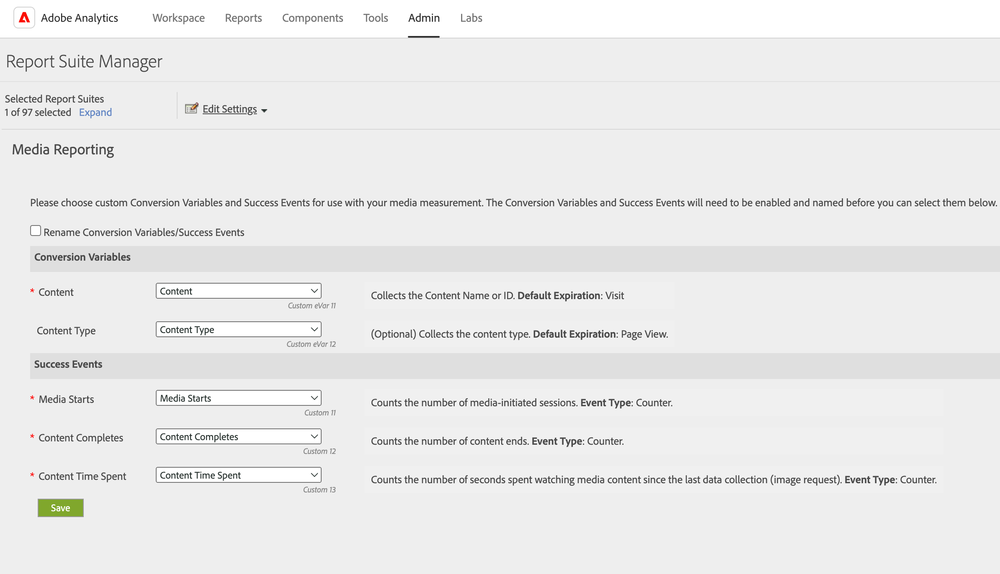

# Les utilisateurs non-administrateurs ne peuvent pas obtenir de données pour des eVars spécifiques.

## Description {#description}

<b>Description</b> :

Une erreur s’affiche ci-dessous pour les utilisateurs non-administrateurs qui ne voient aucune donnée lorsqu’ils tentent d’obtenir des données pour des eVars spécifiques dans Analysis Workspace, même s’ils se voient attribuer un profil de produit qui inclut l’accès aux eVars spécifiques pour la suite de rapports spécifique.
Vous n’avez pas accès à la dimension pour cette requête.

## Résolution {#resolution}

Cela se produit si les eVars sont mappées aux dimensions utilisées pour Media Analytics.
Les utilisateurs administrateurs peuvent vérifier les paramètres sur la page Rapports multimédia.  Pour plus d’informations, consultez la page d’aide ci-dessous.
[https://experienceleague.adobe.com/docs/media-analytics/using/media-reports/media-reports-enable.html?lang=en](https://experienceleague.adobe.com/docs/media-analytics/using/media-reports/media-reports-enable.html?lang=en)
 
Si tel est le cas, deux options sont disponibles ci-dessous pour résoudre ce problème.

- Les utilisateurs administrateurs peuvent affecter les dimensions utilisées pour Media Analytics, telles que Contenu et Type de contenu, au profil de produit en question.
- Si vous n’y voyez pas d’inconvénient, les utilisateurs administrateurs peuvent modifier les mappages des dimensions utilisées pour Media Analytics sur différentes variables de la page de création de rapports multimédia.  Par exemple, vous pouvez modifier le mappage d’eVar11 vers une variable différente, par exemple eVar13, pour la dimension Contenu dans le cas ci-dessous.

