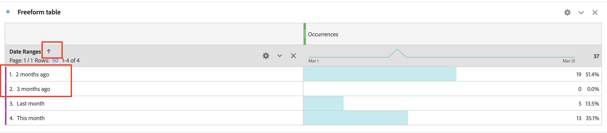

# Comment trier manuellement l’ordre de Dimension de la période dans le rapport Workspace ?

## Description {#description}

Problème :
  
 Je veux trier les Dimensions de la période dans l’ordre &quot;Ce mois&quot; &quot;Mois dernier&quot; &quot;Il y a 2 mois&quot; &quot;Il y a 3 mois&quot;.  Toutefois, en cliquant sur l’icône de tri, l’ordre d’affichage est différent. Comment trier manuellement l’ordre des Dimensions ?  
            

## Résolution {#resolution}

Vous pouvez classer les Dimensions manuellement à l’aide de la fonction &quot;Générateur de tableau&quot;.

Ouvrez le tableau à structure libre, puis cliquez sur le bouton &quot;Activer le créateur de tableau&quot;.

Déposez les Dimensions dans le tableau de votre choix, puis cliquez sur le bouton Créer .

Désormais, les Dimensions sont triées dans l’ordre défini &quot;Ce mois&quot; &quot;Le mois dernier&quot; &quot;Il y a 2 mois&quot; &quot;Il y a 3 mois&quot;

