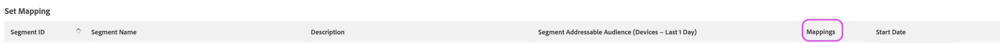

# Destination LiveRamp serveur à serveur

## Description {#description}

<b>Environnement</b>

Adobe Audience Manager

<b>Problème/Symptômes</b>

Cet article présente un aperçu de la destination LiveRamp dans Audience Manager.

<b>Objectifs d’apprentissage</b>

- &#x200B; &#x200B;  du processus de configuration de la destination LiveRamp des  de 
- Processus d’activation des segments

## Résolution {#resolution}

<b>Configuration de la destination LiveRamp</b>

Si vous disposez déjà d’une destination LiveRamp existante, passez à la section d’activation du segment. 

La destination LiveRamp est une [intégration serveur à serveur](https://experienceleague.adobe.com/docs/audience-manager/user-guide/features/destinations/device-based/device-based-destinations-list.html?lang=fr), ce qui signifie que la configuration se produit dans le serveur principal. Pour la première configuration de destination, vous aurez besoin de l’assistance de l’équipe d’assistance clientèle d’Audience Manager. Veuillez ouvrir un dossier via le [Admin Console](https://adminconsole.adobe.com/) demandant la création d’une destination LiveRamp. Veillez à inclure ces détails clés :

- Nom et description de la destination
- Nom du client LiveRamp (valeur alphanumérique fournie par le représentant LR)
- Préférence de mappage de segment : ID de remplissage manuel ou automatique

L’option de mappage des segments affecte le mode de remise à la plateforme LiveRamp. Pour plus d’informations, consultez la section Activation du segment .

<b>Processus d’activation des segments</b>

Une fois que l’équipe d’assistance clientèle a créé la destination, des audiences/segments spécifiques peuvent être activés vers la destination LiveRamp directement depuis l’interface utilisateur. Tout d’abord, vous devez accéder à la destination et sélectionner Modifier :

Vous pouvez maintenant identifier et ajouter le ou les segments que vous souhaitez mapper à partir de cet écran :

La valeur de mappage détermine comment LiveRamp représentera les audiences dans leur plateforme : 

Si vous choisissez de configurer votre destination avec le remplissage automatique (option par défaut), les identifiants de segment seront automatiquement renseignés dans le champ de mappage. Cela signifie que tous vos segments seront organisés par identifiant dans la plateforme LiveRamp.

Si vous choisissez de mapper manuellement les segments, vous pouvez choisir vos propres noms ou identifiants conviviaux pour les segments lors de la définition de la valeur de mappage. L’inconvénient de cette opération est la nécessité de saisir manuellement ces valeurs chaque fois que vous mappez un segment. C’est pourquoi la méthode par défaut et préférée implique le mappage automatique des identifiants de segment. Si vous avez des questions relatives à ce processus, veuillez ouvrir un dossier auprès de l’assistance clientèle de l’Audience Manager afin que nous puissions vous aider davantage.
