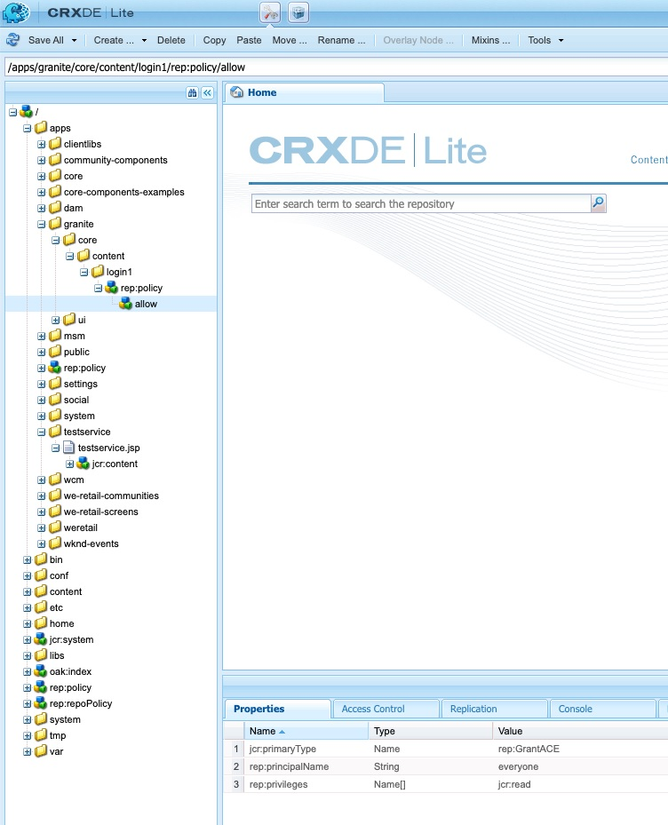

# Comment rediriger vers une page de connexion personnalisée en cas d’échec AEM flux OAuth

## Description {#description}

<b>Environnement</b>
Experience Manager

<b>Problème/Symptômes</b>
Comment rediriger vers la page de connexion personnalisée dans un environnement de publication Adobe Experience Manager (AEM) en cas d’échec de flux AEM Open Authorization (OAuth) ?

## Résolution {#resolution}

Dans le cas du flux SAML (Security Assertion Markup Language)/OAuth, en cas d’erreur dans le flux d’authentification AEM, le système redirige vers la page de connexion d’usine (OOTB) par défaut AEM.

Par conséquent, il est nécessaire de rediriger les utilisateurs vers la page de connexion SAML/OAuth IDP personnalisée. Suivez les étapes ci-dessous :

1. Copier ce chemin de noeud */libs/granite/core/content/login* to */apps/granite/core/content/login1* comme ci-dessous.
2. Modifier le type de ressource de */apps/granite/core/content/login1* to <b>testservice</b>, comme illustré ci-dessous :
3. Créez un `rep:policy` noeud sous login1 avec <b>autoriser enfant</b>, comme illustré ci-dessous :
4. Créez un <b>testservice</b> Dossier sous <b>/apps</b> et ajouter <b>sling:resourceType</b> avec <b>testservice</b> et créez un fichier JSP appelé <b>testservice.jsp</b>, comme illustré ci-dessous : (Remarque : Dans le cas d’un flux OAuth, veillez à ajouter */j_security_check?configid=`<` oauth confiid respectif`>`* vers le chemin de redirection sécurisé dans la propriété <b>JSP</b> below)
5. Ouvrez la configuration OSGI. <b>Gestionnaire d’authentification du sélecteur de connexion Adobe Granite</b> et définissez la page de connexion par défaut sur */apps/granite/core/content/login1* et personnalisez la variable `auth.loginselector.mappings` pour pointer vers ma page de connexion superposée pour votre chemin sécurisé. Consultez le tableau ci-dessous :
6. Ouvrez la configuration OSGI. <b>Service d’authentification Apache Sling</b> et ajouter *-/apps/granite/core/content/login1* et *-/apps/testservice* au `sling.auth.requirements` liste. Consultez le tableau ci-dessous :

