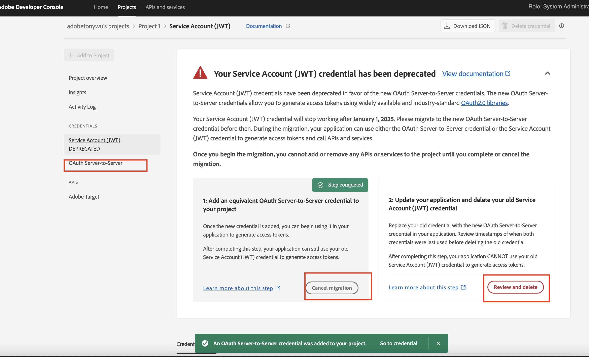
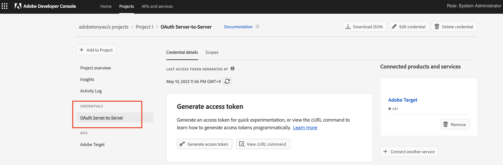

# Guide détaillé pour la migration des informations d’identification de JWT vers OAuth Server-to-Server

## Description {#description}

Guide détaillé pour la migration des informations d’identification de JWT vers OAuth Server-to-Server     <b>Contexte :</b>
    Les informations d’identification du compte de service (JWT) ont été abandonnées au profit des nouvelles informations d’identification OAuth serveur à serveur.  Les nouvelles informations d’identification vous permettent de développer et de gérer plus facilement des applications Adobe.  Elle supprime également la nécessité de faire pivoter régulièrement les certificats et fonctionne de manière prête à l’emploi à l’aide de bibliothèques OAuth2 standard. 

<b>Remarque : Aucune de vos applications ou intégrations Adobe en cours d’exécution ne sera interrompue avant le 1er janvier 2025.</b>        <b></b>      

## Résolution {#resolution}

I. Connectez-vous à la console Adobe Developer ([https://developer.adobe.com/console](https://developer.adobe.com/console)) .

II. Dans le menu de filtrage sur le côté gauche, sélectionnez l’option &quot;Avec des informations d’identification de compte de service (JWT)&quot;.
 De cette manière, tous les projets disposant d’informations d’identification de compte de service (JWT) s’affichent.
 

III. Cliquez sur le bouton &quot;Ajouter de nouvelles informations d’identification&quot; pour lancer la migration.

IV.  Les nouvelles informations d’identification &quot;OAuth Server-to-Server&quot; ont été ajoutées sur le côté gauche.

a. Cliquez sur Annuler la migration si vous devez annuler la migration.
b. Cliquez sur le bouton &quot;Réviser et supprimer&quot; après avoir vérifié que les nouvelles informations d’identification &quot;Serveur à serveur OAuth&quot; fonctionnent correctement et lorsque vous souhaitez supprimer les informations d’identification JWT pour terminer la migration.
 

V.  Mettez à jour le code de l’application client avec la bibliothèque OAuth2.0 pour générer un jeton d’accès avec les nouvelles informations d’identification.

1. [PassportJS](https://github.com/jaredhanson/passport) (Node.js)
2. [Sécurité du printemps](https://spring.io/projects/spring-security) (Java)
3. [Auteur](https://github.com/lepture/authlib) (Python)
4. Afficher d’autres bibliothèques sur  [https://oauth.net/code/](https://oauth.net/code/)

VI.  Passez en revue l’horodatage du menu Dernier accès ou Dernier utilisé pour vérifier les jetons d’accès générés par l’application client à l’aide des nouvelles informations d’identification.

VII. Une fois que vous êtes certain d’avoir remplacé les anciennes informations d’identification, passez à la dernière étape de la suppression des anciennes informations d’identification.

VIII. Désormais, seules les nouvelles informations d’identification pour OAuth Server-to-Server restent sur le côté gauche, une fois la migration terminée.

 
 
<b>Documents de référence</b>
Pour vous assurer que votre application continuera à fonctionner après le 1er janvier 2025, vous devez la migrer pour utiliser les nouvelles informations d’identification OAuth Server-to-Server. Le processus de migration est simple et permet une migration sans interruption. Pour en savoir plus, consultez notre documentation 
1. [Migration des informations d’identification du compte de service (JWT)](https://nam04.safelinks.protection.outlook.com/?url=https%3A%2F%2Fpostoffice.adobe.com%2Fpo-server%2Flink%2Fredirect%3Ftarget%3DeyJhbGciOiJIUzUxMiJ9.eyJ0ZW1wbGF0ZSI6ImJsZXRoZXJfbm90aWNlX29hdXRoX3NlcnZlcl90b19zZXJ2ZXIiLCJlbWFpbEFkZHJlc3MiOiJndXd1K3NvbmVAYWRvYmV0ZXN0LmNvbSIsInJlcXVlc3RJZCI6IjM0ZjIyNTMwLThjMzEtNDlkNC1iZjEyLThlZGIyY2E0ODdhOCIsImxpbmsiOiJodHRwczovL3d3dy5hZG9iZS5jb20vZ28vZGV2c19zMnNfbWlncmF0aW9uX2d1aWRlIiwibGFiZWwiOiI5IiwibG9jYWxlIjoiZW5fVVMifQ.Pr8LjAW5wq_tEqCQLs4Y2fwJSTW_Z2FH0CIVInolEKvySfPDiF7vl8Hg4S9ne_V6a74oLfCVzc99EE9K4XUoBQ&amp;amp;data=05%7C01%7Cguwu%40adobe.com%7C3b1b2261ea264d45d9df08db4ce8a7de%7Cfa7b1b5a7b34438794aed2c178decee1%7C0%7C0%7C638188334359675040%7CUnknown%7CTWFpbGZsb3d8eyJWIjoiMC4wLjAwMDAiLCJQIjoiV2luMzIiLCJBTiI6Ik1haWwiLCJXVCI6Mn0%3D%7C3000%7C%7C%7C&amp;amp;sdata=dd8x%2FoDHh0QUi3xboxa78uA54JXEaVq5qYkP8zkvymk%3D&amp;amp;reserved=0)
2. [Utilisation des nouvelles informations d’identification Oauth Server-to-Server](https://nam04.safelinks.protection.outlook.com/?url=https%3A%2F%2Fpostoffice.adobe.com%2Fpo-server%2Flink%2Fredirect%3Ftarget%3DeyJhbGciOiJIUzUxMiJ9.eyJ0ZW1wbGF0ZSI6ImJsZXRoZXJfbm90aWNlX29hdXRoX3NlcnZlcl90b19zZXJ2ZXIiLCJlbWFpbEFkZHJlc3MiOiJndXd1K3NvbmVAYWRvYmV0ZXN0LmNvbSIsInJlcXVlc3RJZCI6IjM0ZjIyNTMwLThjMzEtNDlkNC1iZjEyLThlZGIyY2E0ODdhOCIsImxpbmsiOiJodHRwczovL3d3dy5hZG9iZS5jb20vZ28vZGV2c19zMnNfY3JlZGVudGlhbF9vdmVydmlldyIsImxhYmVsIjoiMTAiLCJsb2NhbGUiOiJlbl9VUyJ9.c-c4—RAgDvS0l-WI5yIuYBIbzL7OeWXepSzR1AkdVnrTZmWmm7jYmu11JqHZ_UBPANJqYEzEZrtydXY0YQ&amp;amp;data=05%7C01%7Cguwu%40adobe.com%7C3b1b2261ea264d45d9df08db4ce8a7de%7Cfa7b1b5a7b34438794aed2c178decee1 C0%7C0%7C638188334359675040%7CUnknown%7CTWFpbGZsb3d8eyJWIjoiMC4wLjAwMDAiJQIjoiV2luMzIiLCJBTi6Ik1haWwiJXVCI n0%3D%7C3000%7C%7C&amp;amp;sdata=YwiTIXMxPv9MhhVR3sv0g%2Bqi4NP8OERnJxE9C65I0%3D&amp;amp;réservé=0)
3. [Questions fréquentes](https://nam04.safelinks.protection.outlook.com/?url=https%3A%2F%2Fpostoffice.adobe.com%2Fpo-server%2Flink%2Fredirect%3Ftarget%3DeyJhbGciOiJIUzUxMiJ9.eyJ0ZW1wbGF0ZSI6ImJsZXRoZXJfbm90aWNlX29hdXRoX3NlcnZlcl90b19zZXJ2ZXIiLCJlbWFpbEFkZHJlc3MiOiJndXd1K3NvbmVAYWRvYmV0ZXN0LmNvbSIsInJlcXVlc3RJZCI6IjM0ZjIyNTMwLThjMzEtNDlkNC1iZjEyLThlZGIyY2E0ODdhOCIsImxpbmsiOiJodHRwczovL3d3dy5hZG9iZS5jb20vZ28vZGV2c19zMnNfbWlncmF0aW9uX2d1aWRlX2ZhcSIsImxhYmVsIjoiMTEiLCJsb2NhbGUiOiJlbl9VUyJ9.8IlQUL_WbLKsMUDG4VHvqnwqI0l6TzEXSN0I_R_dXCswvDQpusEgm5LstaLYWzPy0crhk_ShRbmjZvMVS5t1Mg&amp;amp;data=05%7C01%7Cguwu%40adobe.com%7C3b1b2261ea264d45d9df08db4ce8a7de%7Cfa7b1b5a7b34438794aed2c178decee1%7C0%7C0%7C638188334359675040%7CUnknown%7CTWFpbGZsb3d8eyJWIjoiMC4wLjAwMDAiLCJQIjoiV2luMzIiLCJBTiI6Ik1haWwiLCJXVCI6Mn0%3D%7C3000%7C%7C%7C&amp;amp;sdata=n4WBY0gemPujdOZRaTMICsePuQJsuh9STbkgEsvyai8%3D&amp;amp;reserved=0)

Pour toute question, contactez votre représentant d’Adobe, le service clientèle ou rendez-vous sur la console Adobe Developer. [forums](https://nam04.safelinks.protection.outlook.com/?url=https%3A%2F%2Fpostoffice.adobe.com%2Fpo-server%2Flink%2Fredirect%3Ftarget%3DeyJhbGciOiJIUzUxMiJ9.eyJ0ZW1wbGF0ZSI6ImJsZXRoZXJfbm90aWNlX29hdXRoX3NlcnZlcl90b19zZXJ2ZXIiLCJlbWFpbEFkZHJlc3MiOiJndXd1K3NvbmVAYWRvYmV0ZXN0LmNvbSIsInJlcXVlc3RJZCI6IjM0ZjIyNTMwLThjMzEtNDlkNC1iZjEyLThlZGIyY2E0ODdhOCIsImxpbmsiOiJodHRwczovL2V4cGVyaWVuY2VsZWFndWVjb21tdW5pdGllcy5hZG9iZS5jb20vdDUvYWRvYmUtZGV2ZWxvcGVyLWNvbnNvbGUvY3QtcC9hZG9iZS1pby1jb25zb2xlIiwibGFiZWwiOiIxMiIsImxvY2FsZSI6ImVuX1VTIn0.P8FY77-eRzVSjnf09no_Hn5owFmpREoMVLK5OSTU6WWBApUGuQH0fokMAu1R0L-uTQlCovlnIGYD7NRoqMFD8g&amp;amp;data=05%7C01%7Cguwu%40adobe.com%7C3b1b2261ea264d45d9df08db4ce8a7de%7Cfa7b1b5a7b34438794aed2c178decee1%7C0%7C0%7C638188334359675040%7CUnknown%7CTWFpbGZsb3d8eyJWIjoiMC4wLjAwMDAiLCJQIjoiV2luMzIiLCJBTiI6Ik1haWwiLCJXVCI6Mn0%3D%7C3000%7C%7C%7C&amp;amp;sdata=%2FhbICP9PCZsfsNDrBYaGlEb%2FREbBJMjNZeWPzoOPJsk%3D&amp;amp;reserved=0).
