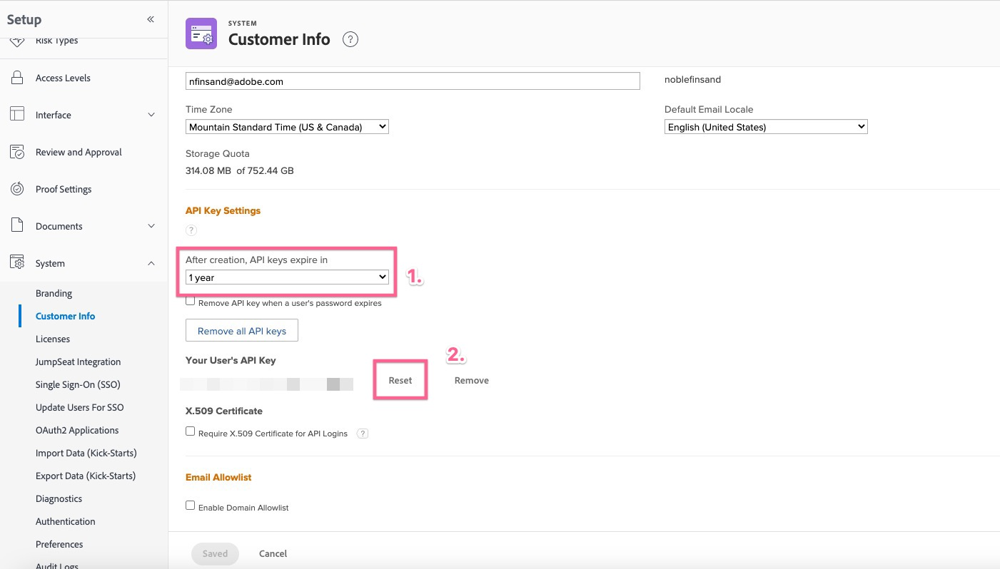

# Erreur de requête incorrecte lors de la configuration du module complémentaire Workfront for Jira

## Description {#description}

<b>Environnement</b> Workfront   <b>Problème/Symptômes</b>
Une erreur de requête incorrecte est présente lors de la tentative d’établissement d’une connexion entre Workfront et Jira lorsqu’aucune clé d’API valide n’est définie dans Workfront pour l’utilisateur.

## Résolution {#resolution}

<b>Étapes à résoudre :</b>
1. Connectez-vous au <b>Workfront</b>, vous souhaitez établir la connexion avec en tant qu’utilisateur.
2. Accédez au <b>Configuration</b>.
   - Accédez à <b>Système</b> `>`  <b>Informations sur le client</b> dans le <b>Workfront</b>.
   - Vérifiez si *Clé API* est présent dans la variable <b>Paramètres de clé API</b> .
3. Si *Clé API* n’est pas présent :
   - Définissez une date d’expiration et cliquez sur <b>Générer</b>.
4. Si une clé API est déjà présente :
   - Vérifiez la durée définie avant le *la clé expire* et cliquez sur <b>Réinitialiser</b>.
5. Accédez à <b>Jira</b> et essayez de vous reconnecter au <b>Workfront</b>.

<b>Liens pertinents :</b>
- [Configuration d’Adobe Workfront pour Jira](https://experienceleague.adobe.com/docs/workfront/using/adobe-workfront-integrations/workfront-for-jira/configure-workfront-for-jira.html?lang=en)
- [Gestion des clés d’API dans Workfront](https://experienceleague.adobe.com/docs/workfront/using/administration-and-setup/manage-wf/security/manage-api-keys.html?lang=en)
