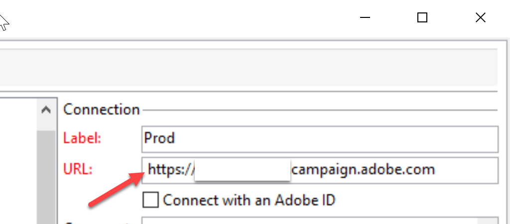

# Erreur : &quot;URL-140005 Impossible de décoder les URL du schéma &#39; https&#39;. Non implémenté&quot;

## Description {#description}

### <b>Environnement</b>

Campaign Classic

### <b>Problème/Symptômes</b>

Une erreur s’est produite lors de la connexion à un compte ACC (Adobe Campaign Classic).

<b>Procédure à suivre :</b>

1. Ouvrez la console ACC.

2. Sélectionnez la connexion ou l’instance à laquelle vous souhaitez vous connecter.

3. Sur la page de connexion, une erreur s’affiche comme suit :

   `Error :"URL-140005 Unable to decode URLs of schema ' https'. Not implemented"`

## Résolution {#resolution}

Supprimez l’espace existant devant le lien de l’instance de l’URL de connexion.

### <b>Cause</b>

Il existait un espace avant l’URL de l’instance enregistrée dans la connexion (voir la capture d’écran).

