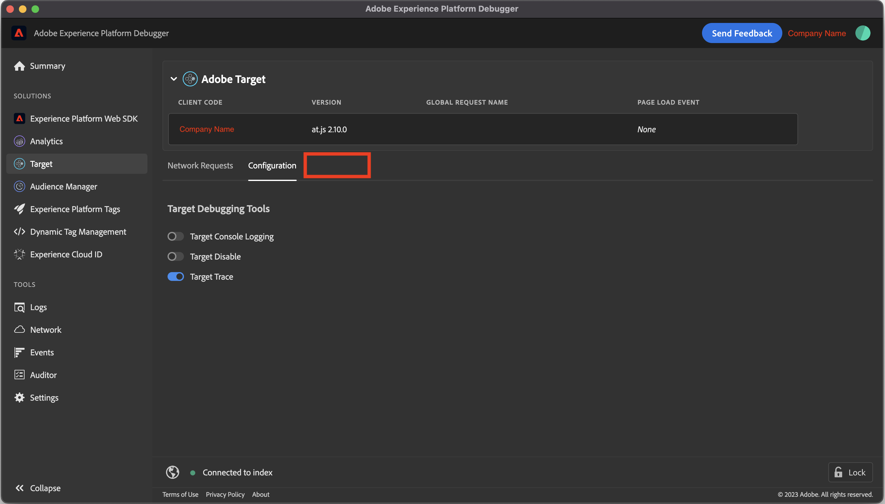

# &quot;Target Traces&quot; n’apparaît pas dans Adobe Experience Platform Debugger

## Description {#description}

L’onglet &quot;Traces cibles&quot; n’apparaît pas dans l’Adobe Experience Platform Debugger.
    

## Résolution {#resolution}

Vérifiez d’abord les conditions suivantes :

- L’utilisateur doit se connecter à une organisation dans laquelle Adobe Target est utilisé sur le site web.
- Bouton bascule &quot;Suivi de la cible&quot; dans Target `>`  Configuration `>`  La section Outils de débogage Target doit être activée.

Si le problème persiste malgré les conditions ci-dessus, essayez ci-dessous.

- Création d’un profil de navigateur

   - Dans le navigateur Chrome :

     Cliquez sur l’icône de profil dans le coin supérieur droit. `>`  Cliquez sur &quot;Ajouter&quot;
   - Installez l’extension Adobe Experience Platform Debugger pour le nouveau profil.

- Rétablir les paramètres du navigateur par défaut

   - Dans le navigateur Chrome :

     En haut à droite, sélectionnez l’icône &quot;Plus&quot;, puis Paramètres.

     Sélectionner Paramètres de réinitialisation `>`  Restaurer les paramètres par défaut d’origine `>`  Réinitialisez les paramètres.
   - Après avoir réinitialisé les paramètres, réactivez l’extension Adobe Experience Platform Debugger.

