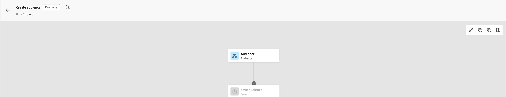

# AEP - Composer l’audience est en lecture seule - Autorisations nécessaires

Si le processus de création lors de l’accès au <b>Audiences</b> pour composer une nouvelle audience, un indicateur en lecture seule s’affiche. Vérifiez si &quot;*Gestion des profils* Les autorisations &quot;ont le&quot;*Gestion des stratégies de fusion* Privilège &quot;.

## Description {#description}

### Environnement

Adobe Experience Platform

### Problème/Symptômes

Lors de l’accès à la section Audiences pour composer une nouvelle audience, le processus de création affiche un indicateur en lecture seule, comme suit :

## Résolution {#resolution}

Pour supprimer l’indicateur en lecture seule, assurez-vous que le signe &quot;*Gestion des profils* Les autorisations &#39; dans AEP contiennent le &#39;<b>Gestion des stratégies de fusion</b>Privilège &quot;. Le drapeau disparaîtra alors :

