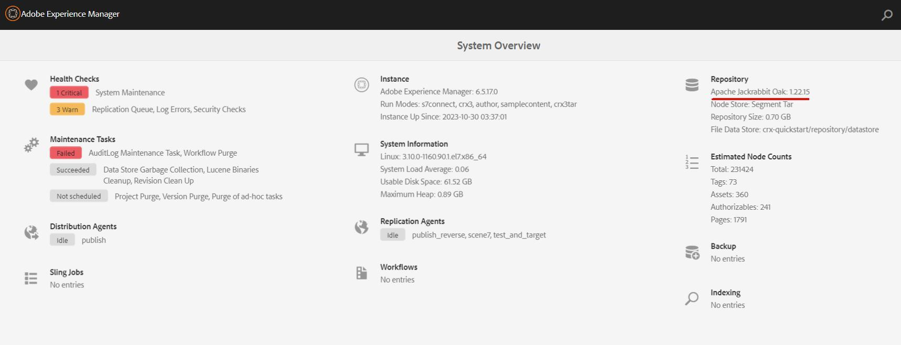

# Procédure d’obtention de l’outil exécuté par Oak pour la version AEM

L’article explique comment obtenir l’outil exécuté par Oak en fonction de la version AEM.

## Description {#description}

### Environnement

AEM 6.5

### Problème/Symptômes

L’article explique comment obtenir l’outil exécuté par Oak en fonction de la version AEM.

## Résolution {#resolution}

L’outil exécuté par Oak présente divers cas d’utilisation lors de l’AEM de fonctionnement, tels que la vérification de la cohérence de la banque de données et la gestion des index.      
1. Présentation du système pour spécifier la version d’Apache Jackrabbit Oak dans l’AEM.
   
2. Accédez au [Référentiel Oak-run](https://repo1.maven.org/maven2/org/apache/jackrabbit/oak-run/). 
3. Téléchargez le dernier outil exécuté par Oak dont la version mineure d’Apache Jackrabbit Oak est la même.

          Exemple : Apache Jackrabbit Oak : 1.22.15, utilisez le dernier outil Oak-run de la version 1.2.x.
