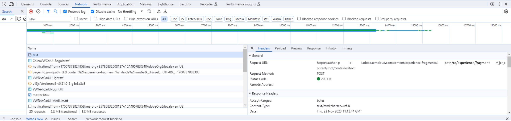

# Problèmes de performance lors de la modification du contenu

Environnement :
AEM as a Cloud Service

Version : AEM SDK v2023.8.13206 ou version ultérieure

## Description {#description}

Les clients qui disposent d’une version AEM du SDK antérieure à la version 2023.9.13665 peuvent rencontrer des problèmes de performances lors de la modification des pages.  
 Par exemple, sur un fragment d’expérience nouveau et vide, l’ajout d’un seul composant de texte prend parfois jusqu’à 15 secondes jusqu’à ce que la page soit réutilisable.
 La page cesse de répondre, attend quelque chose et s’actualise à un moment donné.

## Résolution {#resolution}

<b>Dépannage:</b>

Dans la console de développement du navigateur, vérifiez la requête la plus chronophage et vérifiez l’URL de la requête.

Pour l’exemple ci-dessus :

Recherchez dans le journal d’erreurs de l’auteur le chemin d’accès dans l’URL de demande, par exemple /content/experience-fragments/path/to/experience/fragment/_jcr_content/root/container/text

<b>Résolution:</b>

Lors de la vérification des logs, on peut constater que le coupable du retard est `[` 1`]` . ProcessorUtils attend que la tâche se trouve dans l’index, ce qui peut prendre un certain temps en fonction de l’état des référentiels. En moyenne, le temps d’attente minimal est de 5 à 7 secondes, puis le temps d’exécution de la tâche.

Il s’agit d’un problème connu suivi dans les Jiras internes - SITES-14804 et GRANITE-45493. Néanmoins, un correctif a été mis en oeuvre et il a été inclus dans la version 1.54 d’Oak - `[` 2`]` .

Oak 1.54 a été inclus dans AEM version 2023.9.13665 du sdk.

Par conséquent, l’environnement dans lequel ce problème est rencontré doit être mis à niveau vers une version équivalente ou ultérieure à 2023.9.13665 afin d’atténuer ce comportement.

`[` 1`]`

`author    aemerror    23.11.2023 11:12:44.432    WARN    [  [ 1700737951330]  POST /content/experience-fragments/path/to/experience/fragment/_jcr_content/root/container/text HTTP/1.1]  com.adobe.cq.updateprocessor.impl.ProcessorUtils Deferred job availability; took 13011ms to become available through index.`

`[` 2`]`

[https://issues.apache.org/jira/browse/OAK-10265](https://issues.apache.org/jira/browse/OAK-10265)
