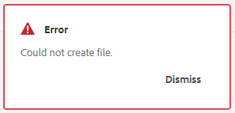

# Guides : erreur lors de la création d’un fichier ditamap

## Description {#description}


Lors de la création d’un fichier ditamap, si l’erreur suivante s’affiche à l’écran même si le fichier ditamap a été créé avec succès :




Les erreurs suivantes s’affichent dans error.log :


```
[ sling-threadpool-d9e57073-a6fb-498c-acdc-5427d775fa27-(apache-sling-job-thread-pool)-31-DXML Post Processing Queue(com/adobe/dxml/postprocess)]  com.adobe.fmdita.uuid.concrete.VersionReferenceCache Error: Unable to find btree prop for ref GUID-fe90ee76-5aa9-4ea2-9e73-61e57af9f0ec.ditamap
javax.jcr.PathNotFoundException: GUID-fe90ee76-5aa9-4ea2-9e73-61e57af9f0ec not found on /var/dxml/btree/version-references-v2/630dc546-719b-4bb8-bdf5-643c44c1bbc7/bc0cdd2b-562c-4619-a8b7-042b21b8cd66/25cf3f9e-7492-4316-8aa6-2a2282308887
at org.apache.jackrabbit.oak.jcr.session.NodeImpl$11.perform(NodeImpl.java:671) [ org.apache.jackrabbit.oak-jcr:1.58.0.T20231123092841-619e1bd]
```


and


```
[ sling-threadpool-d9e57073-a6fb-498c-acdc-5427d775fa27-(apache-sling-job-thread-pool)-31-DXML Post Processing Queue(com/adobe/dxml/postprocess)]  com.adobe.fmdita.uuid.concrete.CORDefaultPostProcess Error: Using default document state Draft due to
javax.jcr.RepositoryException: Unable to fetch states profile for path /content/dam/Matt/alison_test.ditamap Please check whether a Profile has been assigned
at com.adobe.fmdita.profiles.states.ProfileService.getProfileByPath(ProfileService.java:96) [ com.adobe.fmdita.utils:2023.12.0] 
at com.adobe.fmdita.uuid.concrete.CORDocstate.setdocstate(CORDocstate.java:37) [ com.adobe.fmdita.utils:2023.12.0] 
at com.adobe.fmdita.uuid.concrete.CORDocstate.execute(CORDocstate.java:23) [ com.adobe.fmdita.utils:2023.12.0] 
at com.adobe.fmdita.uuid.concrete.CORDefaultPostProcess.execute(CORDefaultPostProcess.java:1) [ com.adobe.fmdita.utils:2023.12.0]
```

` `


## Résolution {#resolution}


Pour résoudre le message d’erreur de création de fichier ditamap, procédez comme suit :

1. Accédez à <b>Outils `>`  Guides `>`  États du document</b><b> `>`  Profil par défaut</b> (ou sélectionnez le profil que vous utilisez) dans l’interface AEM.
2. Assurez-vous qu’un chemin d’accès valide est attribué aux états du document. Le chemin par défaut et recommandé est le suivant : `/content/dam`.
3. Si le chemin d’accès est manquant ou incorrect, ajoutez ou corrigez le chemin d’accès à `/content/dam`.
4. Enregistrez les modifications et tentez de créer à nouveau un fichier ditamap pour confirmer que l’erreur a été résolue.

